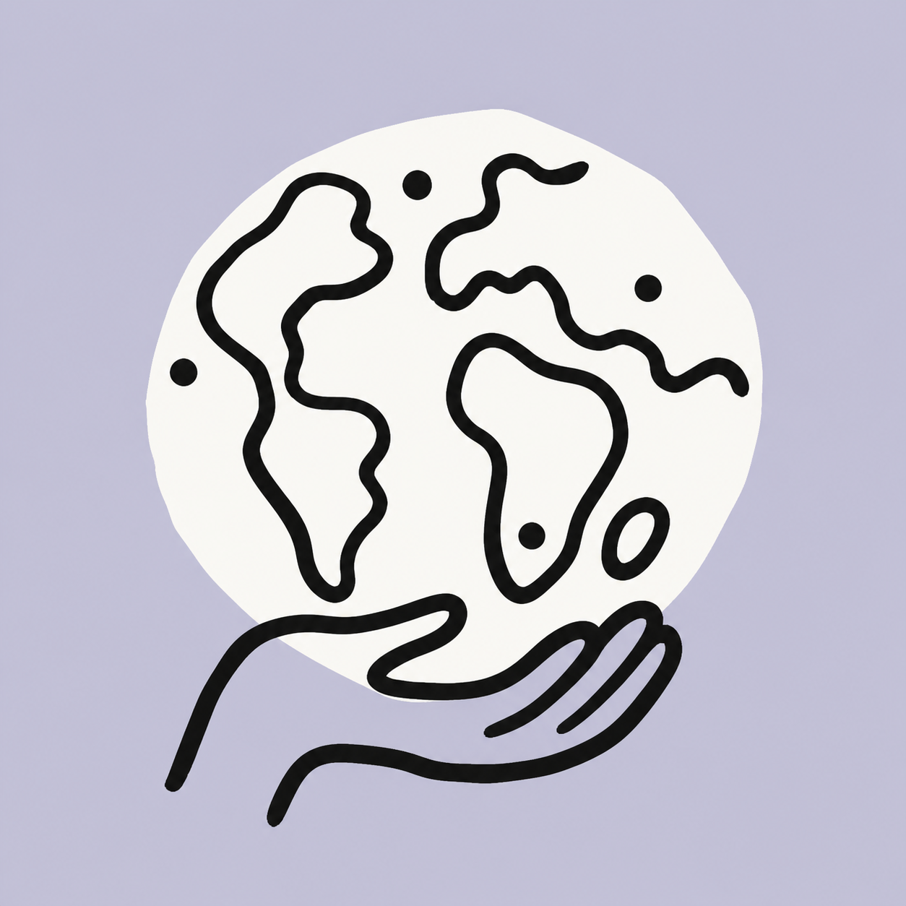
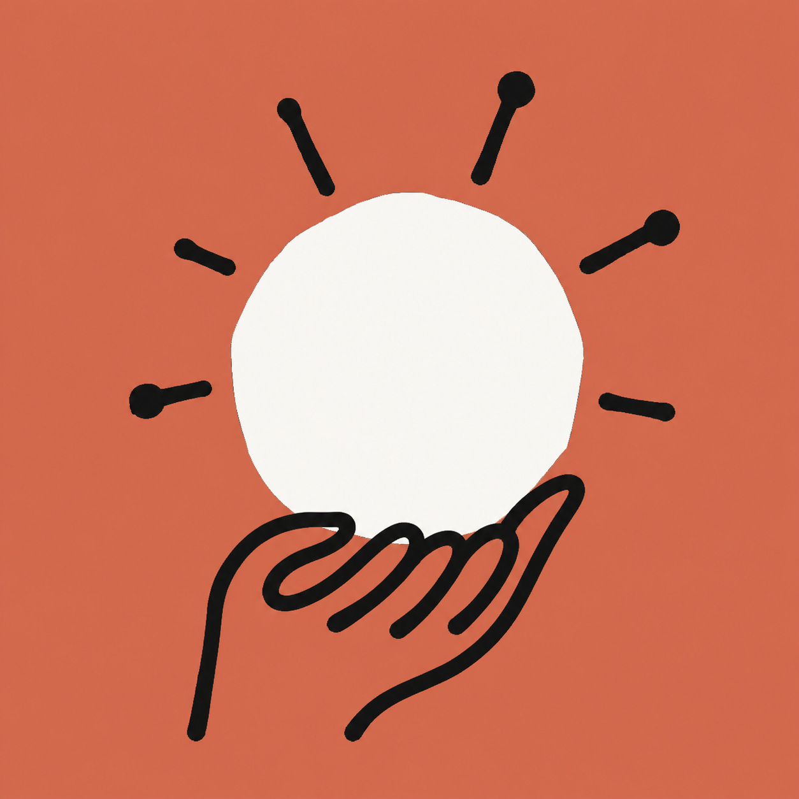
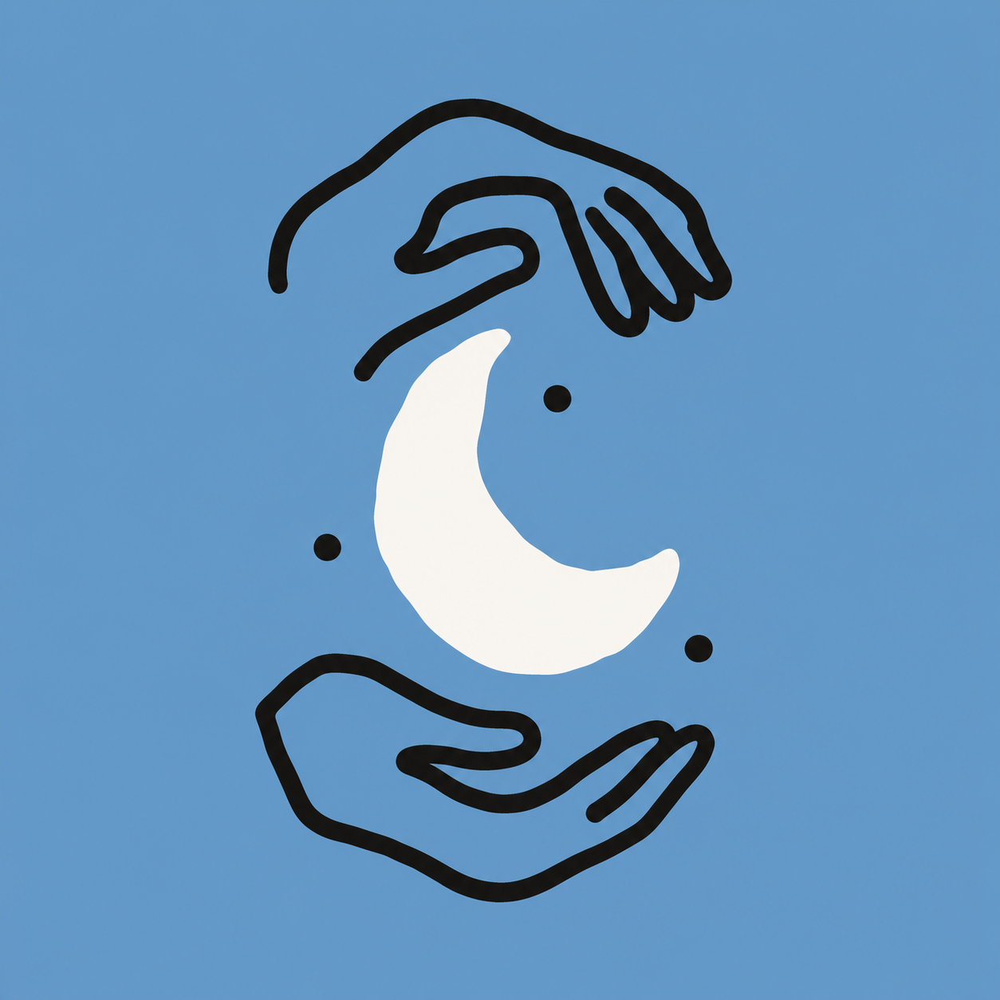

# Anthropic Art

一个用于生成 **Anthropic 风格满背景手绘插画** 的 Agent Skill。

输入一个主题，它会把抽象概念转化成简洁的视觉隐喻，并使用满版柔和背景、不规则象牙白承载形和粗黑手绘线条完成图片。适合新闻配图、博客头图、社交媒体卡片、短视频封面和 AI 概念图。

> 本项目是独立制作的非官方工具，与 Anthropic 没有隶属、授权或合作关系。它学习的是公开页面中可观察到的视觉规律，不复制官方作品的具体构图。

## 效果示例

| 地球 | 太阳 | 月亮 |
|---|---|---|
|  |  |  |

## 它能做什么

- 根据任意主题生成 Anthropic 风格编辑插画。
- 自动把抽象主题提炼成一个清楚的视觉隐喻。
- 默认生成覆盖四个角的完整背景，不会只输出透明图标。
- 使用经过核验的配色、线条、构图和留白规则。
- 自动排除摄影感、3D、渐变、阴影和企业素材库矢量风格。
- 可用于方形社交卡片、横版头图和竖版内容配图。

## 视觉结构

每张图片由三层组成：

1. 覆盖整个画面的不透明强调色背景。
2. 占画面约 55%–80% 的不规则象牙白承载形。
3. 位于最上层的近黑色粗手绘线条。

核心颜色：

| 用途 | 色值 |
|---|---|
| 近黑线条 | `#141413` |
| 象牙白承载形 | `#FAF9F5` |
| 淡绿 cactus | `#BCD1CA` |
| 淡紫灰 heather | `#CBCADB` |
| 燕麦色 oat | `#E3DACC` |
| 陶土橙 clay | `#D97757` |
| 天空蓝 sky | `#6A9BCC` |
| 无花果粉 fig | `#C46686` |

## 安装

### Codex

```bash
git clone https://github.com/HalfAI1102/anthropic-art.git
cp -R anthropic-art/skill ~/.codex/skills/anthropic-art
```

重新启动 Codex 或开启一个新任务后即可使用。

也可以下载本仓库 ZIP，将其中的 `skill` 文件夹复制到 Agent 的 Skills 目录，并重命名为 `anthropic-art`。

## 使用方法

在对话中显式调用：

```text
使用 $anthropic-art 生成一张“人与 AI 共同创作”的方形插画。
```

也可以直接描述主题和用途：

```text
使用 $anthropic-art 生成一张博客头图：一只手把纠缠的思路送进盒子，另一端出来一条清晰的线和一颗星星。使用淡绿色满版背景，不要文字。
```

更多例子：

```text
使用 $anthropic-art 画一个由手托起的地球，1:1，淡紫灰背景。
```

```text
使用 $anthropic-art 表现“保护注意力”：两只手保护一朵小火焰，粉色满版背景，不要文字。
```

```text
使用 $anthropic-art 表现“工作与生活的平衡”：小人站在跷跷板中间，一端是太阳，另一端是月亮。
```

## 通用提示词

```text
生成一张 1:1 的 Anthropic 新闻编辑插画风格社交卡片。

主题：[填写主题]
视觉隐喻：[用一个物体或一组关系表现主题]

背景使用满版、不透明的[颜色与色值]，覆盖画面四个角，不要白边或透明区域。中央放置一块不规则象牙白 #FAF9F5 承载形，主体使用近黑色 #141413 粗手绘线条表现。

线条需要圆头、粗细不均、略有抖动；造型天真、简化、故意略微不对称；保持扁平二维和充足留白，缩小后仍能一眼看懂。

不要文字、透明背景、白色外画布、渐变、阴影、3D、摄影感、精致企业矢量感、Logo 或水印。
```

## 项目结构

```text
anthropic-art/
├── README.md              # GitHub 项目介绍
├── examples/              # 效果示例
└── skill/                 # 可直接安装的标准 Skill
    ├── SKILL.md
    ├── agents/
    ├── assets/
    └── references/
```

## 研究依据

风格规范基于 Anthropic Newsroom 页面、公开 CMS 信息、SVG 素材与 CSS 配色进行核验：

- [Anthropic Newsroom](https://www.anthropic.com/news)
- [Hand House 官方 SVG](https://cdn.sanity.io/images/4zrzovbb/website/cd9cf56a7f049285b7c1c8786c0a600cf3d7f317-1000x1000.svg)
- [Object Globe 官方 SVG](https://cdn.sanity.io/images/4zrzovbb/website/ffc0d7957a232518519f13c0d64896921ea215e2-1000x1000.svg)

详细的配色、构图、参考图角色与失败模式见 [`skill/references/style-spec.md`](skill/references/style-spec.md)。
