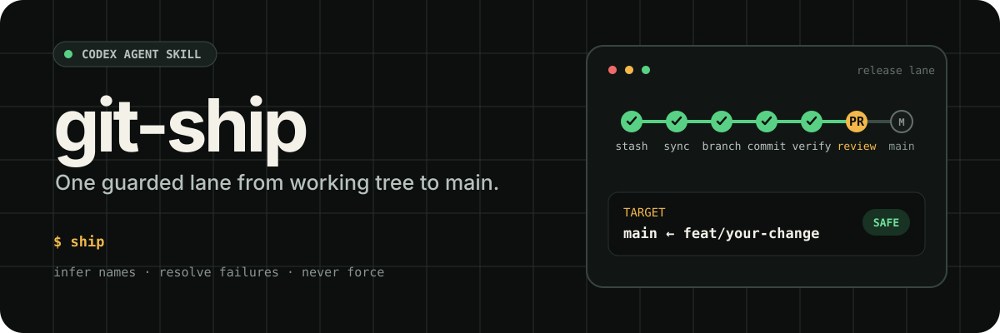
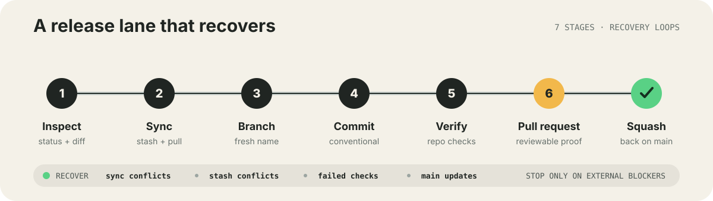

<p align="center">
  
</p>

<p align="center">
  <a href="./README.md">English</a>
</p>

`git-ship` 是一个 Agent Skill，用来完成改动写完之后那段重复的 Git 流程：

```text
工作区改动 → 最新 main → 新分支 → commit → 本地验证 → PR → squash merge
```

调用 `ship` 就表示授权完整发布流程。它会自动生成分支名、Conventional Commit 和 PR 内容，主动解决冲突并修复验证或 CI 失败，直到 PR 成功合并。

<p align="center">
  
</p>

## 它解决什么问题

- 同步最新 `main` 时，先妥善暂存当前改动。
- 每次发布都使用新的语义化分支。
- 自动生成 Conventional Commit 和清楚的 PR 摘要。
- 推送前运行目标仓库已有检查，并主动修复失败。
- 结合最新线上功能和当前功能目标自动解决冲突。
- 读取 CI 日志、修复问题并持续重试。
- PR squash 合并后删除远端分支，并回到最新 `main`。
- 仅在认证、权限、人工审批等外部条件无法自行解决时暂停。

## 安装

把仓库克隆到 Agent 能发现 Skill 的目录：

```bash
git clone https://github.com/oil-oil/git-ship.git ~/.agents/skills/git-ship
```

如果你的客户端使用其他 Skill 目录，请克隆到对应位置。真正的入口文件是 `SKILL.md`。

## 使用

完成改动并保留在工作区，然后告诉 Agent：

```text
ship
```

也可以提前指定分支和 commit：

```text
把这次改动 ship 为 feat/add-export，commit 用 "feat(export): add markdown export"
```

`git-ship` 会展示自动确定的方案，然后立即继续：

```text
📦 准备 ship：
  分支名：feat/add-export
  Commit：feat(export): add markdown export
  目标：main ← feat/add-export（squash merge）
```

不需要确认分支名、commit message、PR 标题或 PR 正文。需要特定名称时，在调用 `ship` 时直接提供即可。

## 工作流程

| 阶段 | 动作 | 安全检查 |
| --- | --- | --- |
| 检查 | 读取工作区和未推送提交 | 没有可发布内容时停止 |
| 同步 | stash 改动并获取最新 `origin/main` | 保留本地独有提交 |
| 分支 | 创建唯一分支或复用当前功能分支 | 不重复提交相同改动 |
| 提交 | 恢复改动并提交全部文件 | 自动解决 stash 冲突 |
| 验证 | 运行仓库已有检查 | 修复根因并循环重跑 |
| 发布 | push 并通过 `gh` 创建 PR | 需要完成 GitHub 登录 |
| CI | 等待必需检查并读取失败日志 | 修复、提交、重新等待 |
| 合并 | 再次同步 main、squash、删分支 | 自动解决新冲突 |
| 完成 | 确认 PR 已合并并回到 `main` | 不使用强推或硬重置 |

## 运行要求

- Git
- 已通过 `gh auth login` 登录的 [GitHub CLI](https://cli.github.com/)
- 主分支为 `main` 的 Git 仓库
- 在 `AGENTS.md`、`README.md`、`package.json`、`pyproject.toml` 或 `Makefile` 等文件中记录验证命令

如果找不到可信的验证命令，Skill 会明确说明跳过，不会自行猜测。

## 安全边界

调用 `ship` 本身就是对完整发布流程、冲突解决和相关验证修复的授权。Skill 会保留最新线上能力与当前功能目标，修复测试、lint、类型、构建和 CI 问题。它不会使用 force push、`reset --hard`、跳过检查或弱化有效测试。只有认证、权限、人工审批等外部阻塞才需要用户介入。

## 自定义

你可以 fork 仓库并修改 `SKILL.md`，接入团队自己的分支命名、合并策略、PR 模板或必跑检查。增加自动化时，应保留非破坏性修复原则和外部权限边界。

## 参与贡献

欢迎提交 Issue 和 PR。请保持改动聚焦，说明新增的 Git 行为，并为每个新增动作写清楚失败处理。

## 开源协议

[MIT](./LICENSE)
