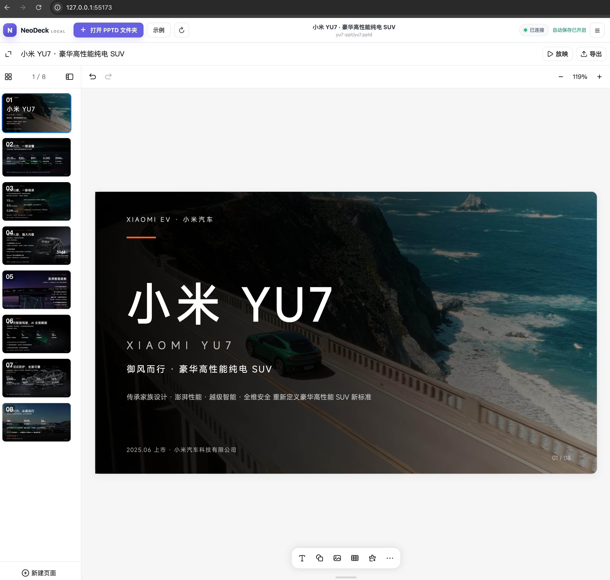
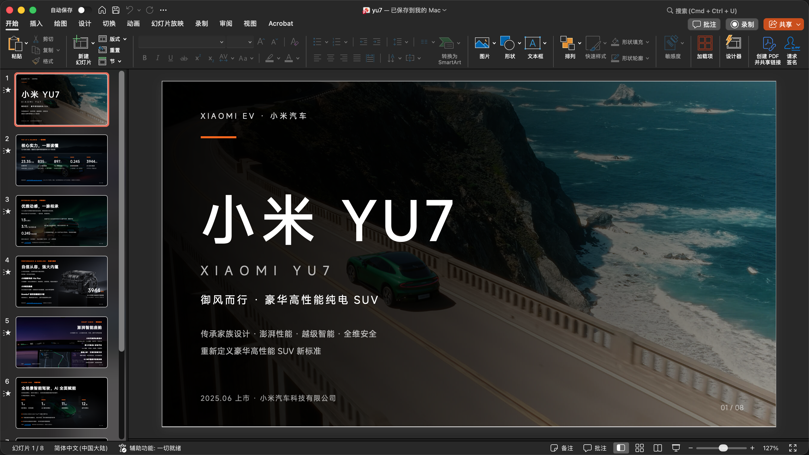
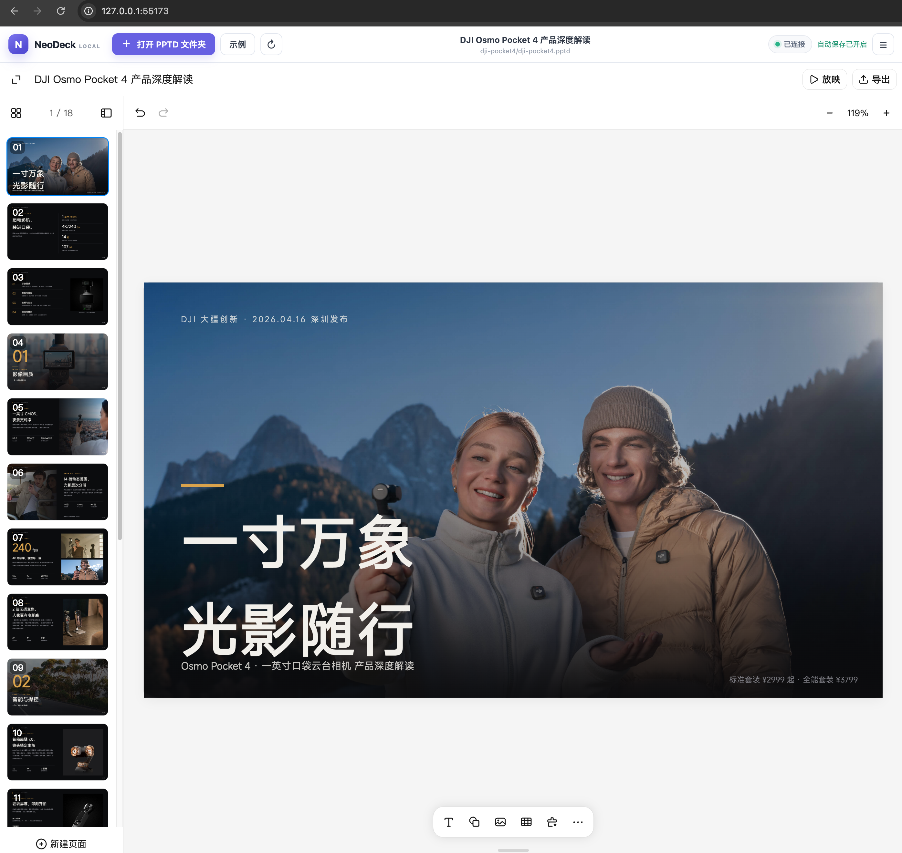
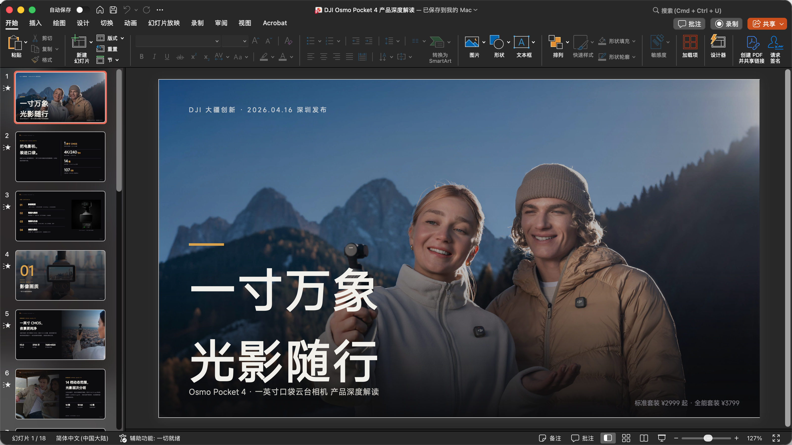

# open-kimi-ppt-skill

[简体中文](README.md) | [English](README_EN.md)

[](https://www.npmjs.com/package/open-kimi-ppt-skill)
[](https://nodejs.org)

```bash
# 先删掉旧软链
rm ~/.codex/skills/open-kimi-ppt

# 再指向新位置（把 <新路径> 换成实际路径）
ln -s <新路径>/skills/open-kimi-ppt ~/.codex/skills/open-kimi-ppt
```

逆向 Kimi Slides 实现的非官方演示文稿 Skill，让 AI Coding Agent 可以创建、编辑、复刻、读取并导出 PPT/PPTX。每次生成默认产出两份文件：可继续编辑的 PPTD 项目，以及嵌入字体、带淡入淡出翻页切换的 PPTX。支持页内元素动画和[预设主题](theme.md)，附带本地浏览器编辑器，可随时手动导出 PPTX。支持 Codex、Claude Code、Cursor、WorkBuddy 等任何兼容 SKILL.md 规范的 Agent。

> [!IMPORTANT]
> 本项目通过逆向分析 Kimi Slides Skill、PPTD 格式以及公开网页编辑器的前端行为与通信协议实现，并非 Kimi 或 Moonshot AI 的官方项目，也未获得其认可或支持。项目依赖的公开前端资源和兼容协议可能随 Kimi 更新而失效，仅供学习与研究使用。

## 安装

需要 Node.js 18 或更高版本。**请用 `npx` 安装，不要 clone 仓库**：仓库图片多、体积大，`npx` 只取打包后的 Skill 文件。默认装到共享目录 `~/.agents/skills/open-kimi-ppt`（Windows 为 `%USERPROFILE%\.agents\skills\open-kimi-ppt`），多数 Agent 装一次即可发现。

### 方式一：让 AI 安装（推荐）

对 AI 说「帮我用 npx 安装 open-kimi-ppt skill」，或直接让它执行：

```bash
npx open-kimi-ppt-skill@latest install -y
```

### 方式二：终端手动安装

```bash
# 交互多选目录（空格选择、回车确认）
npx open-kimi-ppt-skill install

# 非交互：只装共享目录
npx open-kimi-ppt-skill install -y

# 装到全部已检测到的 Agent 目录（不存在的会跳过）
npx open-kimi-ppt-skill install --all
```

`--all` 与交互多选会检测以下目录：`~/.agents/skills`、`~/.codex/skills`、`~/.claude/skills`、`~/.cursor/skills`、`~/.workbuddy/skills`。

### Agent 发现不了 Skill 时

先用共享目录，不要默认对每个 Agent 各装一遍；确认某个 Agent 发现不了时，再为它单独指定目录（`--target` 可重复，Windows 下用 `%USERPROFILE%` 代替 `~`）：

```bash
npx open-kimi-ppt-skill@latest install --target ~/.codex/skills --target ~/.claude/skills
```

### 更新

再执行一次 `npx open-kimi-ppt-skill@latest install -y` 即可覆盖更新；当初用过 `--target` / `--all` 就带上相同参数。更新只替换 Skill 文件，不影响已生成的 PPTD / PPTX 项目。

## 使用

### 让 Agent 生成 PPT

安装完成后，直接向 Agent 描述需求即可。默认会同时生成完整的 PPTD 项目目录（可继续编辑）和对应的 PPTX 文件；只有明确要求只输出 PPTD 时才会跳过 PPTX 生成。

为了更稳定的出品，Prompt 里最好带上风格（如「深色产品发布风」），或附上参考 PPT 模板；只写主题、不给风格时效果更容易波动。

#### Prompt 示例

**示例 1：小米 YU7（约 8 页，图片作背景）**

```text
使用 open-kimi-ppt 做一个介绍小米 yu7的 PPT,要求图片做背景,素材从网上找,8 页左右
```

| 在线编辑 PPTD | 导出 PPTX |
| :---: | :---: |
| [](docs/images/example-yu7-editor.png) | [](docs/images/example-yu7-pptx.png) |

[](docs/images/example-workbuddy-yu7.png)

**示例 2：DJI Pocket 4（图片作背景）**

```text
使用 open-kimi-ppt 帮我生成DJI Pocket4 的 PPT,要求图片做背景,素材从网上找
```

| 在线编辑 PPTD | 导出 PPTX |
| :---: | :---: |
| [](docs/images/example-dji-pocket4-editor.png) | [](docs/images/example-dji-pocket4-pptx.png) |

**示例 3：iPhone 17 Pro（约 8 页）**

```text
使用 open-kimi-ppt 制作 iPhone 17 Pro 介绍 PPT
```

[](docs/images/example-iphone-17pro.png)

**示例 4：带页内元素动画（现场演示）**

```text
使用 open-kimi-ppt 做一个介绍小米 yu7的 PPT,要求图片做背景,素材从网上找,8 页左右
要求带元素入场动画
```

成品示例见 [example/xiaomi-yu7-ppt-animation](example/xiaomi-yu7-ppt-animation)（含 PPTD 项目与 PPTX，可用 `npx open-kimi-ppt-skill serve` 打开预览动画）。

### 在线编辑与手动导出

建议直接让 AI 启动本地编辑器，例如说：

```text
帮我执行 npx open-kimi-ppt-skill serve
```

也可以自己在终端运行：

```bash
npx open-kimi-ppt-skill serve
```

然后打开 <http://127.0.0.1:55173/>，选择包含 `.pptd` 清单、`pages/` 和 `media/` 的完整项目文件夹，即可在浏览器中查看、编辑项目并导出 PPTX。仓库自带的 [example/dji-pocket4](example/dji-pocket4) 是一个完整的 18 页示例项目，可直接打开体验。

```bash
# 启动后自动打开浏览器
npx open-kimi-ppt-skill serve --open

# 使用其他端口
npx open-kimi-ppt-skill serve --port 56000
```

可写目录需要使用支持 File System Access API 的 Chromium 系浏览器；其他浏览器会回退为只读文件夹上传。按 `Ctrl+C` 停止服务。

### Windows：常驻调试浏览器说明

仅在使用 **视觉质检**（`export_images.py`）或 **`--browser` PPTX**（本地编辑器 UI）时需要。默认 Node WASM 导出不启动浏览器。

在 Windows 上走浏览器路径时，脚本会自动启动一个**常驻的调试浏览器**。这是有意设计，不是异常进程：

- **为什么需要**：agent-browser 在 Windows 下无法自行启动 Chrome（Chrome 启动器把进程交接给子进程后立即退出，被误判为崩溃），导出只能改为驱动一个外部启动的浏览器。
- **它是什么**：优先使用本机 Chrome，未安装时回退到 Edge；以 `--remote-debugging-port`（默认 `9337`）和独立配置目录 `%TEMP%\okp-cdp-profile` 启动，窗口定位在屏幕外，不影响日常使用。
- **为什么常驻**：导出完成后实例保持运行，下次导出会复用同一个实例，而不是每导一次就多一个浏览器进程——设计目标是「最多一个，反复复用」。若想关掉，直接结束该浏览器进程即可，下次导出会自动重新拉起。
- **想完全自控**：自行以 `--remote-debugging-port=<端口>` 启动浏览器，并把环境变量 `AGENT_BROWSER_CDP` 设为该端口，脚本会优先使用你自己的实例。

macOS / Linux 无此行为，不受影响。

## 功能特性

- PPTD 生成：让 Agent 生成完整、可继续编辑的 PPTD 项目，支持从零创作、风格迁移、模板复用、图片/PDF 复刻。
- 预设主题：内置约 30 套官方同款 design system，点名即可套用；完整列表与预览图见 [theme.md](theme.md)。
- 元素动画：默认不加。提示词加上「要求带元素入场动画」即可，由 AI 按页编排合适的入场效果。
- PPTX 生成：默认同步生成 PPTX，自动嵌入字体并写入淡入淡出翻页切换（与页内元素动画是两回事）。
- 视觉质检：多模态模型在导出 PPTX 前自动导出整份页面图片、拼接总览图逐项核查（变形、遮挡、出界、对比度、排版、文字溢出），问题页面修复后复检，直至全部通过。
- 在线编辑：通过浏览器查看和编辑本地 PPTD 项目，自动保存，可配置页面切换动画。
- 手动导出：在编辑器中随时手动导出 PPTX。
- 格式互转：将现有 PPTX 转换为 PPTD 后继续修改。
- 安全可控：本地编辑仅在用户明确授权的项目目录内读写文件。

## 为什么选 open-kimi-ppt

常见 PPT Skill 大致分三类：用代码库直接拼 OOXML / pptxgenjs、整页生成图片再塞进 PPTX、或输出网页 HTML 翻页。open-kimi-ppt 走的是 PPTD 中间层 + 真实可编辑 PPTX 这条路线，想让 Agent 好写、人好看、PowerPoint 能改。

| | open-kimi-ppt | 代码拼 PPTX（如 pptxgenjs） | 整页图片 PPT | 网页 HTML PPT |
| --- | --- | --- | --- | --- |
| 交付物 | PPTD 项目 + PPTX | 多为仅 PPTX | 多为仅 PPTX | 单文件 HTML |
| Agent 友好度 | YAML 逐页描述，结构清晰 | 坐标/API 细节多，易排版翻车 | 依赖出图模型与提示词 | HTML/CSS 模板约束强 |
| PowerPoint 可编辑 | 文本、形状、图片可继续改 | 可编辑，但难二次精修 | 整页位图，难改字 | 不是原生 PPTX |
| 视觉质量 | 真实版式 + 导出前多模态质检 | 依赖 Agent 手调布局 | 画面统一，偏海报感 | 动效强，适合演示分享 |
| 二次编辑 | 浏览器可视化编辑 + 自动保存 | 主要靠改代码重导出 | 基本需重新出图 | 改 HTML 源码 |
| 适用场景 | 要交可改的正式 PPTX，又要好看 | 结构化汇报、模板填充 | 视觉统一的海报风讲稿 | 浏览器内演讲 / 发布会 |

具体来说：

- PPTD 用 YAML 描述主题、布局与元素，比直接写 OOXML / pptxgenjs 更稳，也比整页渲一张图更方便局部修改。
- 默认同时交付两份文件：可继续迭代的 PPTD 项目，加上嵌字体、带淡入淡出翻页的 PPTX，不是只给半成品。
- 提示词写「要求带元素入场动画」即可启用元素动画，具体效果与节奏由 AI 处理，不用自己点名动画类型。
- 导出的 PPTX 里，文本框、形状仍可在 PowerPoint / WPS 中编辑，不像图片型 PPT 只能当海报。
- 浏览器里可以预览、微调、配置切换动画并再次导出，不用每次都让 Agent 重跑全流程。
- 导出前会做视觉质检：整页截图加总览图，检查遮挡、出界、对比度、溢出等问题，修完再出 PPTX。
- 不绑定官方模型，成本更低。相对官方 Kimi Slides，可以在任意兼容 Agent 里使用 DeepSeek 等低成本模型；模型不支持多模态时，按 PPTD 规范生成也能做出像样的成品，有多模态时再做一遍视觉质检会更稳。

[](docs/images/example-deepseek-liquid-glass.png)

*上图：在 WorkBuddy 中用 DeepSeek-V4-Flash 生成的 Apple Liquid Glass 风格 PPT。*

[](docs/images/example-reasonix-deepseek.png)

*上图：在 Reasonix 中使用 DeepSeek-V4-Flash 生成 DJI Pocket 4 Pro PPT。*

[](docs/images/example-codex-iphone17pro.png)

*上图：在 ChatGPT / Codex 中使用 5.6 Luna 模型生成的 iPhone 17 Pro PPT。*

### 关于风格与主题

默认 **不会** 自动套用固定主题：未指定风格时由 Agent 按场景指南自行发挥。Skill 内另附约 30 套官方同款 preset，**仅在你点名时**才会使用（例如「用 pine-green-strategy」）。

完整主题名、风格说明与预览图见 **[theme.md](theme.md)**。

> [!TIP]
> 建议在 Prompt 里写明 PPT 风格、点名一套 preset，或直接附上参考 PPT / PPTX 模板。有风格约束或模板参照时，效果会稳定不少；只给主题不给风格时，Agent 只能自行发挥，容易波动。

常见用法：

1. **在 Prompt 里描述风格**：例如「深色科技风」「杂志排版」「苹果 liquid glass」「极简留白 + 大字报」等；
2. **点名预设主题**：例如「用 `pine-green-strategy`」——主题列表见 [theme.md](theme.md)；
3. **提供参考模板**：上传现有 PPT / PPTX / 截图，让 Agent 迁移配色、版式与风格。

可组合使用：先点名 preset 或给模板定调，再用一句话补充本次要强化的风格。

## 界面预览

| 在线编辑 PPTD | 导出 PPTX |
| :---: | :---: |
| [](docs/images/editor-overview.png) | [](docs/images/export-pptx.png) |

## 什么是 PPTD

PPTD 是一种基于 YAML 的演示文稿 DSL，是 OOXML 之上的简化抽象层：保留主题、页面布局、元素位置等核心信息，去除了 Master 等复杂嵌套，每页自包含、所见即所得。完整的格式定义见 [reference/pptd.md](skills/open-kimi-ppt/reference/pptd.md)。

一个完整的 PPTD 项目目录结构如下：

```text
deck/
  deck.pptd     # 清单文件
  pages/        # 每页一个 .page 文件
  media/        # 本地媒体资源（如有）
  deck.pptx     # 默认同步生成的 PPTX 成品
```

## 工作原理与安全边界

- CLI 只在 `127.0.0.1` 启动静态文件服务，不会监听局域网地址。
- 浏览器只在用户主动授权后读取完整 PPTD 项目目录。
- 保存回调只允许修改 `.pptd` 和 `.page` 文件，并拒绝绝对路径与 `..` 路径越界。
- 默认编辑与 PPTX / 图片导出使用本地 neo-ppt 镜像 + patched WASM，**不依赖** `www.kimi.com`；远程图片、字体若被文稿引用仍可能从对应服务器加载。
- 视觉质检（`export_images.py`）与 `--browser` 路径驱动的是同一套本地编辑器（需本机 Chromium），不再访问公开 Kimi 站。
- 本项目不会提供或注入 Kimi 登录令牌，也不会访问用户的 Kimi 私有文稿。

## 本地开发

```bash
npm install --global .
npm test
npm run pack:check
```

## 声明

Kimi、Kimi Slides 及相关商标归其权利人所有。
