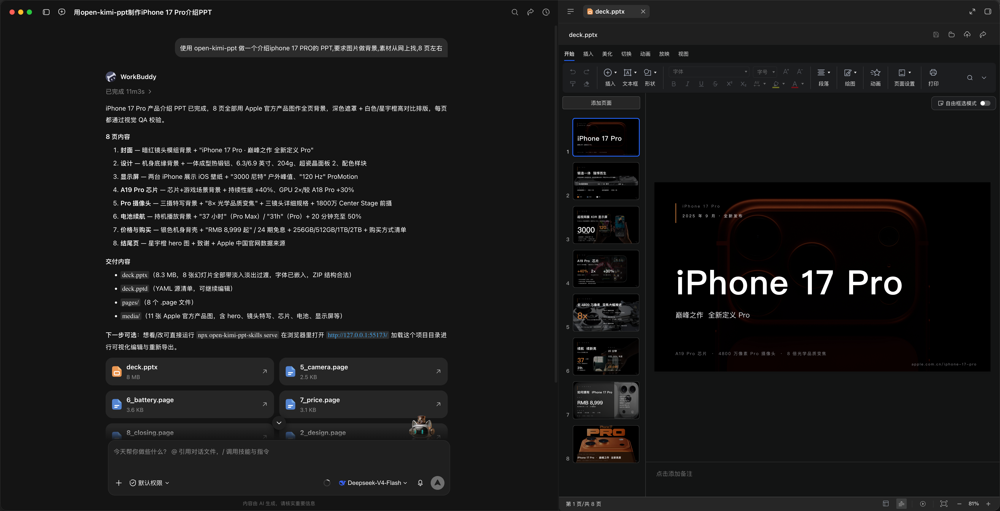
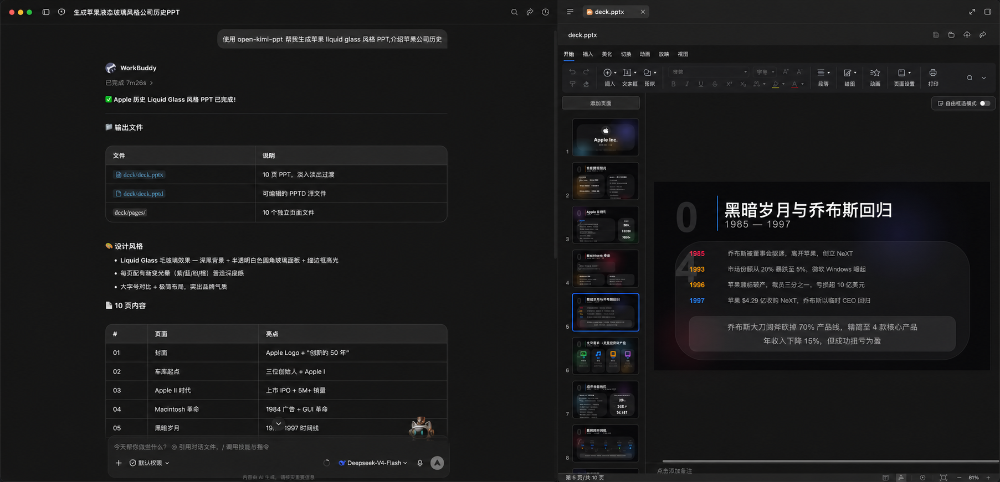
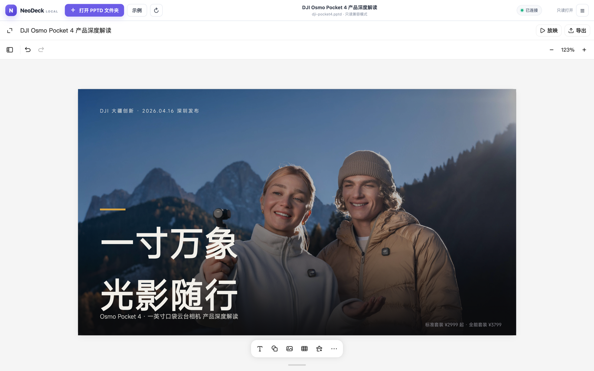

# open-kimi-ppt-skill

[简体中文](README.md) | [English](README_EN.md)

[](https://www.npmjs.com/package/open-kimi-ppt-skill)
[](https://nodejs.org)

An unofficial presentation skill for AI coding agents, reverse-engineered from Kimi Slides. It lets your agent create, edit, replicate, read, and export PPT/PPTX files. Each run produces two outputs by default: an editable PPTD project, and a PPTX with embedded fonts and fade page transitions. On-slide element animations and [preset themes](theme_EN.md) are supported, and a local in-browser PPTD editor is included for manual export. Works with Codex, Claude Code, Cursor, WorkBuddy, and any agent that supports the SKILL.md format.

> [!IMPORTANT]
> This project is implemented by reverse-engineering the Kimi Slides skill, the PPTD format, and the frontend behavior and communication protocol of the publicly accessible web editor. It is not an official Kimi or Moonshot AI project and is not endorsed or supported by them. Public frontend resources and compatibility contracts used by this project may change without notice. Provided for learning and research purposes only.

## Install

Node.js 18 or later is required. **Install with `npx` — do not clone the repository**: the repo ships many images and is heavy, while `npx` only fetches the packaged skill files. The default location is the shared directory `~/.agents/skills/open-kimi-ppt` (Windows: `%USERPROFILE%\.agents\skills\open-kimi-ppt`), which most agents discover with a single install.

### Option 1: Ask your agent (recommended)

Say "Install the open-kimi-ppt skill for me with npx", or have it run:

```bash
npx open-kimi-ppt-skill@latest install -y
```

**WorkBuddy users**: WorkBuddy can't discover the shared directory. Say "Install the open-kimi-ppt skill for me with npx into WorkBuddy", or have it run:

```bash
# macOS / Linux
npx open-kimi-ppt-skill@latest install --target ~/.workbuddy/skills
# Windows
npx open-kimi-ppt-skill@latest install --target %USERPROFILE%\.workbuddy\skills
```

### Option 2: Manual install

```bash
# Interactive checklist (space to select, Enter to confirm)
npx open-kimi-ppt-skill install

# Non-interactive: shared directory only
npx open-kimi-ppt-skill install -y

# All detected agent skill directories (missing ones are skipped)
npx open-kimi-ppt-skill install --all
```

Directories detected by `--all` and the interactive checklist: `~/.agents/skills`, `~/.codex/skills`, `~/.claude/skills`, `~/.cursor/skills`, `~/.workbuddy/skills`.

### When an agent can't discover the skill

Start with the shared directory instead of installing once per agent. If a specific agent can't discover the skill there, pass its directory explicitly (`--target` may be repeated; on Windows use `%USERPROFILE%` instead of `~`):

```bash
npx open-kimi-ppt-skill@latest install --target ~/.codex/skills --target ~/.claude/skills
```

### Update

Run `npx open-kimi-ppt-skill@latest install -y` again to overwrite the local installation; if you originally used `--target` / `--all`, pass the same flags. Updating only replaces the skill files and does not touch PPTD / PPTX projects you already generated.

## Usage

### Generate a presentation with your agent

Once installed, just describe what you need. By default you get both the complete, editable PPTD project directory and the matching PPTX file. PPTX generation is skipped only when you explicitly ask for PPTD-only output.

For more stable quality, put a style in the prompt (e.g. “dark product-launch look”) or attach a reference PPT template; topic-only prompts without style guidance tend to vary more.

```text
Use open-kimi-ppt to create a liquid-glass-style deck about the history of Apple.
```

**Example: Xiaomi YU7 (~8 pages, images as backgrounds)**

```text
Use open-kimi-ppt to create a Xiaomi YU7 intro PPT, with images as backgrounds from the web, about 8 pages.
```

[](docs/images/example-workbuddy-yu7.png)

**Example: iPhone 17 Pro (~8 pages)**

```text
Use open-kimi-ppt to create an iPhone 17 Pro intro PPT.
```

[](docs/images/example-iphone-17pro.png)

**Example: on-slide element animations (live presentation)**

```text
Use open-kimi-ppt to create a Xiaomi YU7 intro PPT, with images as backgrounds from the web, about 8 pages.
Require element entrance animations.
```

See the sample deck at [example/xiaomi-yu7-ppt-animation](example/xiaomi-yu7-ppt-animation) (PPTD project + PPTX; open with `npx open-kimi-ppt-skill serve` to preview animations).

### Edit online and export manually

Prefer asking your agent to start the local editor, for example:

```text
Run npx open-kimi-ppt-skill serve for me.
```

Or run it yourself in a terminal:

```bash
npx open-kimi-ppt-skill serve
```

Then open <http://127.0.0.1:55173/> and choose a complete project folder containing the `.pptd` manifest, `pages/`, and `media/` to view, edit, and export PPTX in the browser. The bundled [example/dji-pocket4](example/dji-pocket4) project — a complete 18-page deck — is ready to open for a quick tour.

```bash
# Open the browser after startup
npx open-kimi-ppt-skill serve --open

# Use another port
npx open-kimi-ppt-skill serve --port 56000
```

Writable folder access requires a Chromium-based browser with the File System Access API. Other browsers fall back to read-only folder upload. Press `Ctrl+C` to stop the server.

### Windows: a persistent debug browser

Only needed for **visual QA** (`export_images.py`) or the **`--browser` PPTX fallback**. Default local WASM export does not start a browser.

On Windows, the browser path automatically starts a **persistent debug browser**. This is by design, not a stray process:

- **Why it's needed**: agent-browser cannot launch Chrome by itself on Windows (the Chrome launcher hands off to a child process and exits immediately, which is misread as a crash), so the export drives an externally started browser instead.
- **What it is**: your installed Chrome (falling back to Edge), launched with `--remote-debugging-port` (default `9337`) and a dedicated profile at `%TEMP%\okp-cdp-profile`, with the window positioned off-screen so it stays out of the way.
- **Why it persists**: the instance intentionally keeps running after the export. Relaunching with the same profile joins the existing browser, so repeated exports reuse one instance instead of piling up processes — the design goal is "at most one, reused forever". To get rid of it, just kill the browser process; the next export starts a fresh one.
- **Take full control**: start your own browser with `--remote-debugging-port=<port>` and set the `AGENT_BROWSER_CDP` environment variable to that port; the script prefers your instance.

macOS and Linux are unaffected.

## Features

- PPTD generation: let your agent generate complete, editable PPTD projects, from scratch, with style transfer, template reuse, or replication from images/PDFs.
- Preset themes: ~30 official-style design systems you can name to apply; full list with previews in [theme_EN.md](theme_EN.md).
- Element animations: off by default. Add `Require element entrance animations` to the prompt and the agent picks suitable on-slide effects per page.
- PPTX generation: a matching PPTX is produced by default, with fonts embedded and fade page transitions written automatically (separate from on-slide element animations).
- Visual QA: with a multimodal model, the skill exports every page as an image, stitches them into an overview sheet, and checks each page (distortion, occlusion, out-of-bounds elements, contrast, layout consistency, text overflow) before PPTX export, fixing and re-checking until every page passes.
- Online editing: view and edit local PPTD projects in a browser, with autosave and configurable slide transitions.
- Manual export: export PPTX manually from the editor at any time.
- Format conversion: convert existing PPTX files to PPTD for further editing.
- Secure by design: local editing only reads and writes project directories explicitly authorized by the user.

## Why open-kimi-ppt

Most PPT skills fall into three buckets: assemble OOXML / pptxgenjs in code, render each slide as a full-bleed image, or ship a swipeable HTML deck. open-kimi-ppt takes a different path: a PPTD intermediate layer plus real editable PPTX output, meant to be easy for agents to write and still editable in PowerPoint.

| | open-kimi-ppt | Code-built PPTX (e.g. pptxgenjs) | Full-slide image PPT | Web HTML PPT |
| --- | --- | --- | --- | --- |
| Deliverable | PPTD project + PPTX | Usually PPTX only | Usually PPTX only | Single HTML file |
| Agent-friendly | Clear per-page YAML | Lots of coordinates/API detail | Depends on image models & prompts | Strong HTML/CSS template constraints |
| Editable in PowerPoint | Text, shapes, images stay editable | Editable, but hard to refine later | Flat bitmaps — hard to reword | Not native PPTX |
| Visual quality | Real layouts + multimodal QA before export | Relies on agent layout tuning | Cohesive, poster-like | Strong motion; great for live demos |
| Re-editing | Browser visual editor + autosave | Mostly re-run code | Usually regenerate images | Edit HTML source |
| Best for | Formal PPTX you still need to tweak | Structured reports / template fills | Visually unified poster decks | In-browser talks / launches |

Specifically:

- PPTD describes theme, layout, and elements in YAML, which is more stable than raw OOXML / pptxgenjs and easier to edit locally than full-slide images.
- You get both deliverables by default: an iterable PPTD project plus a ready-to-open PPTX with embedded fonts and fade page transitions.
- Add `Require element entrance animations` to the prompt and the agent chooses effects and timing for you.
- Text boxes and shapes in the exported PPTX remain editable in PowerPoint / WPS, unlike image-only decks.
- You can preview, tweak, set transitions, and re-export in the browser without rerunning the whole agent flow.
- Before export, full-page screenshots plus an overview sheet are used to catch occlusion, overflow, contrast, and layout issues.
- It is not locked to the official model, so it costs less. Unlike official Kimi Slides, you can run this in any compatible agent with cheaper models such as DeepSeek. Even without multimodal vision, a model that follows the PPTD spec can still produce decent decks; with a multimodal model you additionally get the visual QA pass.

[](docs/images/example-deepseek-liquid-glass.png)

*Above: an Apple Liquid Glass-style deck generated with DeepSeek-V4-Flash in WorkBuddy.*

[](docs/images/example-reasonix-deepseek.png)

*Above: a DJI Pocket 4 Pro deck generated with DeepSeek-V4-Flash in Reasonix.*

[](docs/images/example-codex-iphone17pro.png)

*Above: an iPhone 17 Pro deck generated with the 5.6 Luna model in ChatGPT / Codex.*

### Style and themes

By default the agent **does not** auto-apply a fixed theme: without a style cue it follows the scenario guides. The skill also ships ~30 official-style presets, used **only when you name one** (e.g. “use pine-green-strategy”).

Browse theme IDs, descriptions, and preview images in **[theme_EN.md](theme_EN.md)**.

> [!TIP]
> It helps to state a PPT style in the prompt, name a preset, or attach a reference PPT / PPTX template. With a style constraint or template to follow, output is noticeably more consistent. Topic-only prompts leave the agent to invent a look, so results vary more.

Common approaches:

1. **Describe the style in the prompt** — e.g. dark tech, magazine layout, Apple liquid glass, minimal big-type poster slides;
2. **Name a preset theme** — e.g. “use `pine-green-strategy`”; see the catalog in [theme_EN.md](theme_EN.md);
3. **Provide a reference template** — upload an existing PPT / PPTX / screenshot and ask the agent to transfer colors, layout, and overall style.

You can combine these: lock the look with a preset or template, then add one line about the style you want to emphasize.

## Screenshots

| Edit PPTD online | Export PPTX |
| :---: | :---: |
| [](docs/images/editor-overview.png) | [](docs/images/export-pptx.png) |

## What is PPTD

PPTD is a YAML-based presentation DSL — a simplified abstraction layer over OOXML. It preserves the essentials (theme, page layout, element positions) while dropping complex nesting such as Masters; every page is self-contained — what you see is what you get. See [reference/pptd.md](skills/open-kimi-ppt/reference/pptd.md) for the complete definition.

A complete PPTD project looks like this:

```text
deck/
  deck.pptd     # manifest
  pages/        # one .page file per slide
  media/        # local media assets (if any)
  deck.pptx     # PPTX generated by default
```

## How it works and security boundaries

- The CLI serves static files on `127.0.0.1` only and does not listen on LAN interfaces.
- The browser reads a complete PPTD project directory only after explicit user authorization.
- Save callbacks may only modify `.pptd` and `.page` files; absolute paths and `..` traversal are rejected.
- Default editing and PPTX/image export use the local neo-ppt mirror plus patched WASM and do **not** depend on `www.kimi.com`. Remote images or fonts referenced by the deck may still be fetched from their hosts.
- Visual QA (`export_images.py`) and `--browser` drive that same local editor (Chromium required) and no longer hit the public Kimi site.
- This project does not provide or inject Kimi login tokens and does not access private Kimi documents.

## Local development

```bash
npm install --global .
npm test
npm run pack:check
```

## Legal

Kimi, Kimi Slides, and related trademarks belong to their respective owners.
