# 预设设计主题（Design System Presets）

[简体中文](theme.md) | [English](theme_EN.md)

Skill 内置多套设计系统，**仅在用户点名时使用**（自选设计不会自动套用）。

## 怎么用

在 Prompt 里点名主题 ID，例如：

```text
使用 open-kimi-ppt，主题用 pine-green-strategy，做一份 AI 战略咨询 PPT，12 页左右
```

Agent 会读取对应 `design.md`（或补充目录下的同名 `.md`）作为唯一风格源。

---

## 主目录（推荐）

### 咨询策略 · Consulting / Strategy

*适合战略咨询、尽调、转型、高管汇报*

#### `apricot-white-brief` — Apricot White Brief

- **风格**: 杏白底咨询简报风，高密度论证、细线图表
- **文件**: [`consulting/apricot-white-brief/design.md`](skills/open-kimi-ppt/reference/design_system/consulting/apricot-white-brief/design.md)
- **点名**: `用 apricot-white-brief`

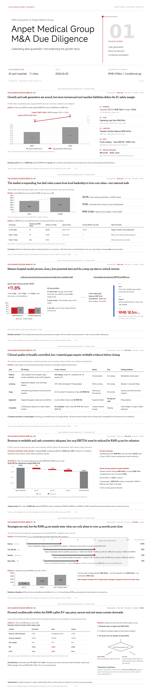

#### `indigo-due-diligence` — Indigo Due Diligence

- **风格**: 靛蓝尽调风，麦肯锡式信息密度与框架图
- **文件**: [`consulting/indigo-due-diligence/design.md`](skills/open-kimi-ppt/reference/design_system/consulting/indigo-due-diligence/design.md)
- **点名**: `用 indigo-due-diligence`

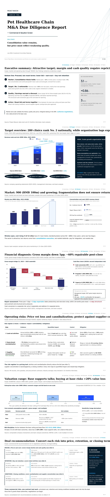

#### `marine-blue-research` — Marine Blue Research

- **风格**: 海蓝研究风，专业咨询研究报告版式
- **文件**: [`consulting/marine-blue-research/design.md`](skills/open-kimi-ppt/reference/design_system/consulting/marine-blue-research/design.md)
- **点名**: `用 marine-blue-research`

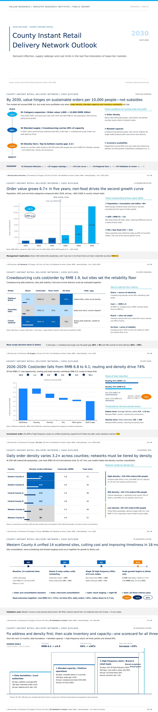

#### `moss-green-transformation` — Moss Green Transformation

- **风格**: 苔绿转型风，战略落地与变革叙事
- **文件**: [`consulting/moss-green-transformation/design.md`](skills/open-kimi-ppt/reference/design_system/consulting/moss-green-transformation/design.md)
- **点名**: `用 moss-green-transformation`

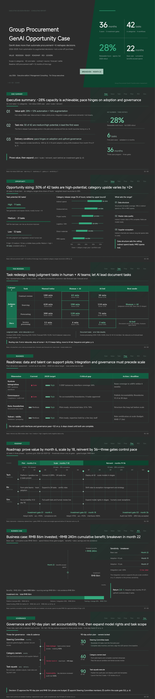

#### `pine-green-strategy` — Pine Green Strategy

- **风格**: 松绿战略风，深色题头条 + 薄荷绿强调
- **文件**: [`consulting/pine-green-strategy/design.md`](skills/open-kimi-ppt/reference/design_system/consulting/pine-green-strategy/design.md)
- **点名**: `用 pine-green-strategy`

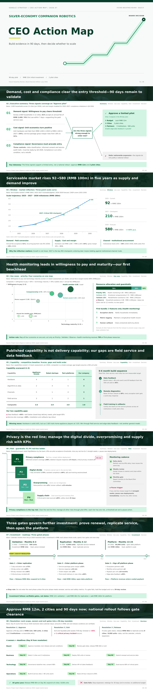

#### `red-black-growth` — Red-Black Growth

- **风格**: 红黑增长风，强对比结论导向
- **文件**: [`consulting/red-black-growth/design.md`](skills/open-kimi-ppt/reference/design_system/consulting/red-black-growth/design.md)
- **点名**: `用 red-black-growth`

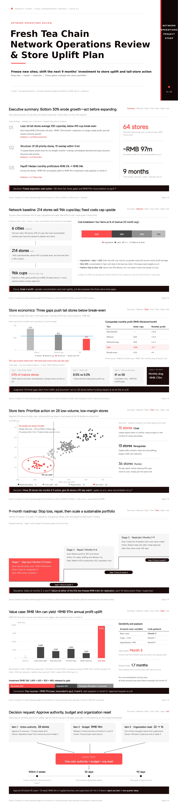

---

### 商务财务 · Finance / Business

*适合投研、年报、备忘录、财务分析*

#### `black-gold-ledger` — Black Gold Ledger

- **风格**: 黑金台账风，机构级投研报告
- **文件**: [`finance/black-gold-ledger/design.md`](skills/open-kimi-ppt/reference/design_system/finance/black-gold-ledger/design.md)
- **点名**: `用 black-gold-ledger`

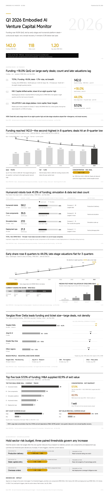

#### `ebony-ledger` — Ebony Ledger

- **风格**: 乌木台账风，深色金融研究气质
- **文件**: [`finance/ebony-ledger/design.md`](skills/open-kimi-ppt/reference/design_system/finance/ebony-ledger/design.md)
- **点名**: `用 ebony-ledger`

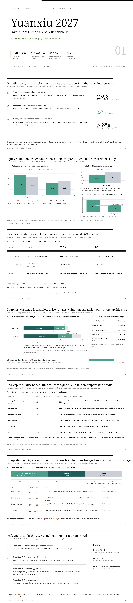

#### `honey-orange-memo` — Honey Orange Memo

- **风格**: 蜜橙备忘录风，温暖商务投研备忘
- **文件**: [`finance/honey-orange-memo/design.md`](skills/open-kimi-ppt/reference/design_system/finance/honey-orange-memo/design.md)
- **点名**: `用 honey-orange-memo`

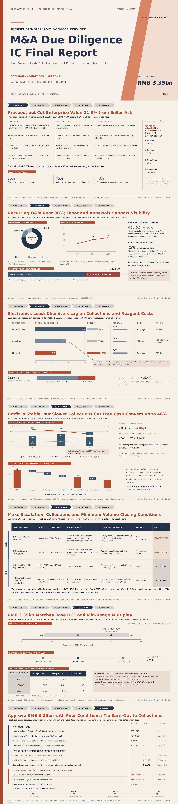

#### `lake-blue-memo` — Lake Blue Memo

- **风格**: 湖蓝备忘录风，清爽财务研究备忘
- **文件**: [`finance/lake-blue-memo/design.md`](skills/open-kimi-ppt/reference/design_system/finance/lake-blue-memo/design.md)
- **点名**: `用 lake-blue-memo`

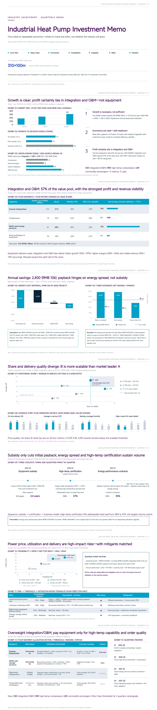

#### `prospect-annual` — Prospect Annual

- **风格**: 展望年报风，机构年度研究出版感
- **文件**: [`finance/prospect-annual/design.md`](skills/open-kimi-ppt/reference/design_system/finance/prospect-annual/design.md)
- **点名**: `用 prospect-annual`

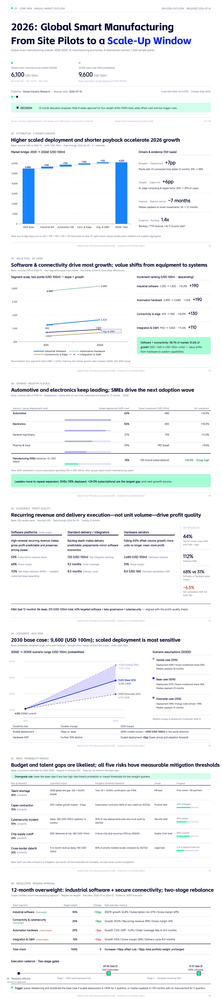

#### `rice-paper-annual` — Rice Paper Annual

- **风格**: 宣纸年报风，米白纸感大标题编辑风
- **文件**: [`finance/rice-paper-annual/design.md`](skills/open-kimi-ppt/reference/design_system/finance/rice-paper-annual/design.md)
- **点名**: `用 rice-paper-annual`

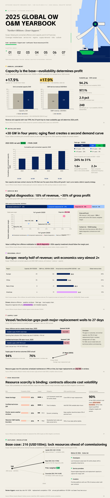

---

### 工作汇报 · Work Report

*适合经营复盘、项目进展、品牌与业务综述*

#### `blue-flame-brand` — Blue Flame Brand

- **风格**: 蓝焰品牌风，结论先行的业务复盘
- **文件**: [`work/blue-flame-brand/design.md`](skills/open-kimi-ppt/reference/design_system/work/blue-flame-brand/design.md)
- **点名**: `用 blue-flame-brand`

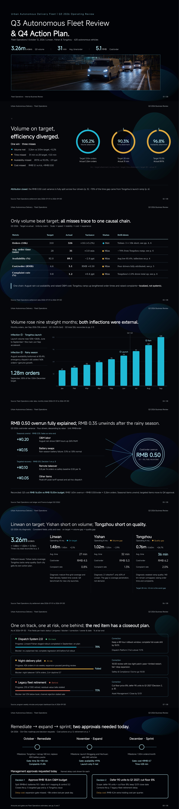

#### `electric-violet-business` — Electric Violet Business

- **风格**: 电紫商务风，经营复盘与进展汇报
- **文件**: [`work/electric-violet-business/design.md`](skills/open-kimi-ppt/reference/design_system/work/electric-violet-business/design.md)
- **点名**: `用 electric-violet-business`

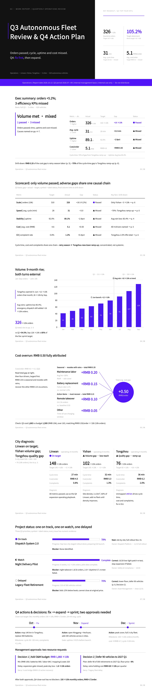

#### `moon-white-imagery` — Moon-White Imagery

- **风格**: 月白影像风，大图叙事 + 经营结论
- **文件**: [`work/moon-white-imagery/design.md`](skills/open-kimi-ppt/reference/design_system/work/moon-white-imagery/design.md)
- **点名**: `用 moon-white-imagery`

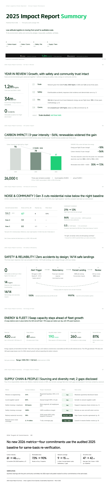

#### `sky-blue-wayfinding` — Sky Blue Wayfinding

- **风格**: 天蓝导视风，清晰导航式工作汇报
- **文件**: [`work/sky-blue-wayfinding/design.md`](skills/open-kimi-ppt/reference/design_system/work/sky-blue-wayfinding/design.md)
- **点名**: `用 sky-blue-wayfinding`

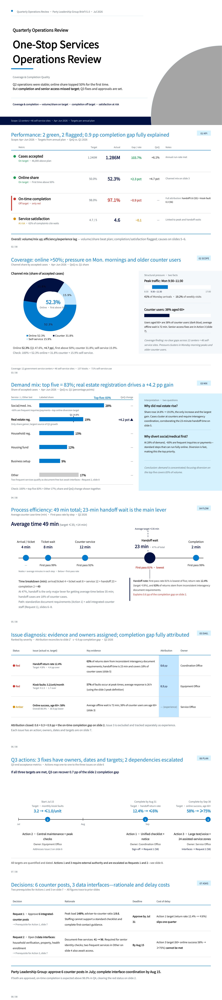

#### `warm-clay-works` — Warm Clay Works

- **风格**: 暖陶作品风，高完成度作品集式汇报
- **文件**: [`work/warm-clay-works/design.md`](skills/open-kimi-ppt/reference/design_system/work/warm-clay-works/design.md)
- **点名**: `用 warm-clay-works`

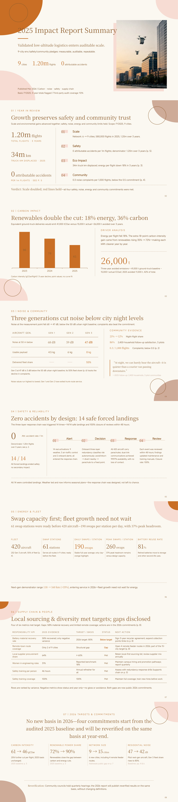

#### `warm-jade-annual-report` — Warm Jade Annual Report

- **风格**: 暖玉年报风，经营年报与复盘
- **文件**: [`work/warm-jade-annual-report/design.md`](skills/open-kimi-ppt/reference/design_system/work/warm-jade-annual-report/design.md)
- **点名**: `用 warm-jade-annual-report`

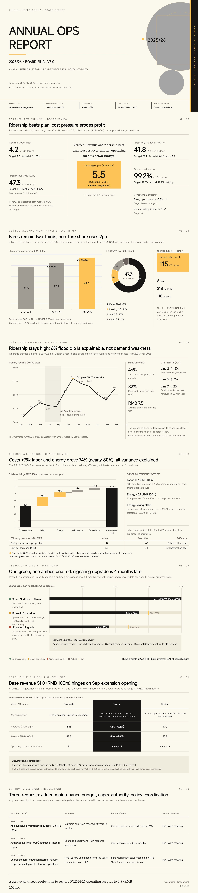

---

### 品牌推广 · Promotion / Brand

*适合品牌叙事、杂志风、活动与公益传播*

#### `aqua-charity-report` — Aqua Charity Report

- **风格**: 水色公益报告风，品牌公益传播
- **文件**: [`promotion/aqua-charity-report/design.md`](skills/open-kimi-ppt/reference/design_system/promotion/aqua-charity-report/design.md)
- **点名**: `用 aqua-charity-report`

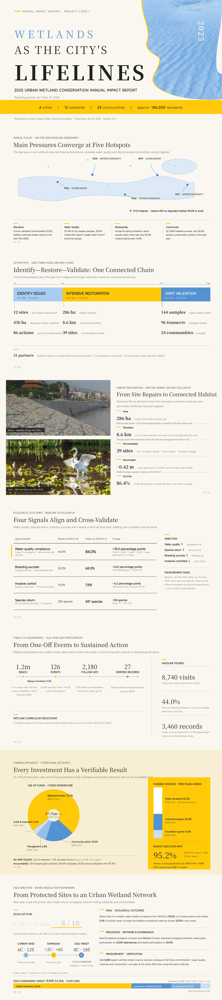

#### `cream-collage` — Cream Collage

- **风格**: 奶油拼贴风，情绪化品牌拼贴叙事
- **文件**: [`promotion/cream-collage/design.md`](skills/open-kimi-ppt/reference/design_system/promotion/cream-collage/design.md)
- **点名**: `用 cream-collage`

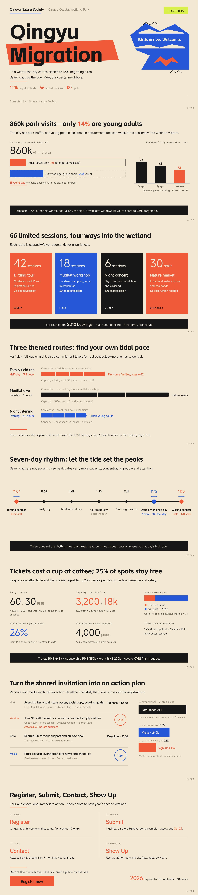

#### `pine-soot-pictorial` — Pine Soot Pictorial

- **风格**: 松烟画报风，画报感品牌年刊
- **文件**: [`promotion/pine-soot-pictorial/design.md`](skills/open-kimi-ppt/reference/design_system/promotion/pine-soot-pictorial/design.md)
- **点名**: `用 pine-soot-pictorial`

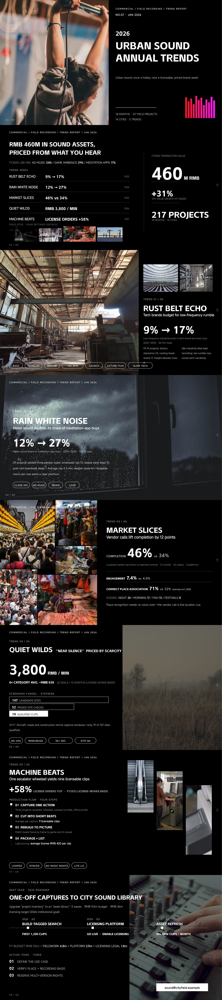

#### `silk-yellow-magazine` — Silk Yellow Magazine

- **风格**: 丝黄杂志风，高密度杂志编辑排版
- **文件**: [`promotion/silk-yellow-magazine/design.md`](skills/open-kimi-ppt/reference/design_system/promotion/silk-yellow-magazine/design.md)
- **点名**: `用 silk-yellow-magazine`

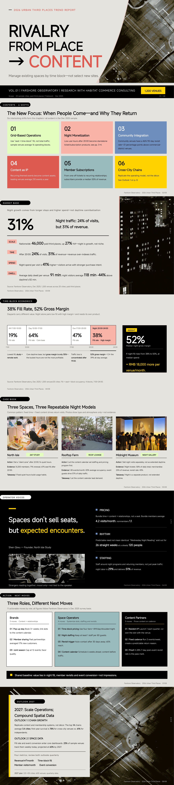

#### `silver-gray-luxury-magazine` — Silver-Gray Luxury Magazine

- **风格**: 银灰奢华杂志风，高端品牌刊感
- **文件**: [`promotion/silver-gray-luxury-magazine/design.md`](skills/open-kimi-ppt/reference/design_system/promotion/silver-gray-luxury-magazine/design.md)
- **点名**: `用 silver-gray-luxury-magazine`

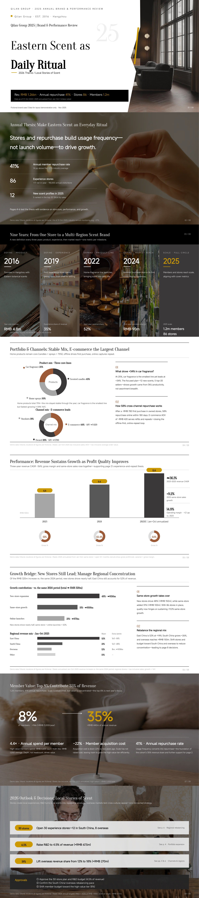

#### `travel-green-handbook` — Travel Green Handbook

- **风格**: 旅行绿手册风，旅行/目的地手册气质
- **文件**: [`promotion/travel-green-handbook/design.md`](skills/open-kimi-ppt/reference/design_system/promotion/travel-green-handbook/design.md)
- **点名**: `用 travel-green-handbook`

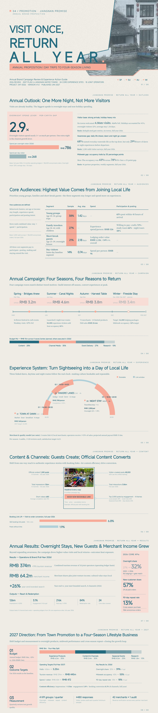

---

### 学术教育 · Academic

*适合答辩、课件、论文汇报、数据推导*

#### `blue-line-courseware` — Blue-Line Courseware

- **风格**: 蓝线课件风，严谨学术课件排版
- **文件**: [`academic/blue-line-courseware/design.md`](skills/open-kimi-ppt/reference/design_system/academic/blue-line-courseware/design.md)
- **点名**: `用 blue-line-courseware`

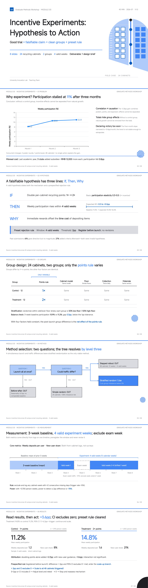

#### `deep-blue-atlas` — Deep Blue Atlas

- **风格**: 深蓝图集风，研究讲座与图集叙事
- **文件**: [`academic/deep-blue-atlas/design.md`](skills/open-kimi-ppt/reference/design_system/academic/deep-blue-atlas/design.md)
- **点名**: `用 deep-blue-atlas`

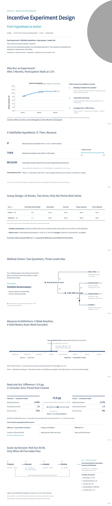

#### `paper-white-courseware` — Paper White Courseware

- **风格**: 纸白课件风，论文答辩级排版
- **文件**: [`academic/paper-white-courseware/design.md`](skills/open-kimi-ppt/reference/design_system/academic/paper-white-courseware/design.md)
- **点名**: `用 paper-white-courseware`

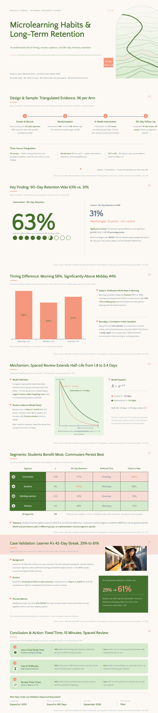

#### `pastel-derivation` — Pastel Derivation

- **风格**: 粉彩推导风，公式/推导渐进揭示
- **文件**: [`academic/pastel-derivation/design.md`](skills/open-kimi-ppt/reference/design_system/academic/pastel-derivation/design.md)
- **点名**: `用 pastel-derivation`

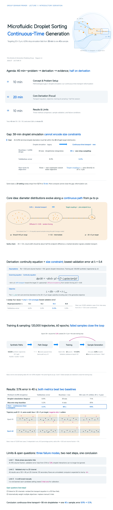

#### `teal-green-academic-defense` — Teal-Green Academic Defense

- **风格**: 青绿答辩风，硕博答辩正式感
- **文件**: [`academic/teal-green-academic-defense/design.md`](skills/open-kimi-ppt/reference/design_system/academic/teal-green-academic-defense/design.md)
- **点名**: `用 teal-green-academic-defense`

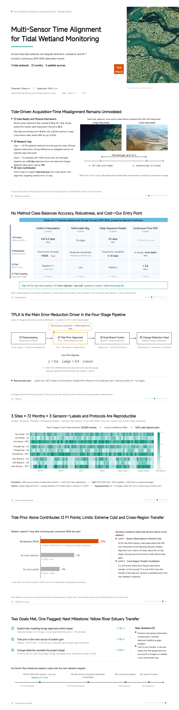

#### `wine-red-data` — Wine Red Data

- **风格**: 酒红数据风，学术数据可视化
- **文件**: [`academic/wine-red-data/design.md`](skills/open-kimi-ppt/reference/design_system/academic/wine-red-data/design.md)
- **点名**: `用 wine-red-data`

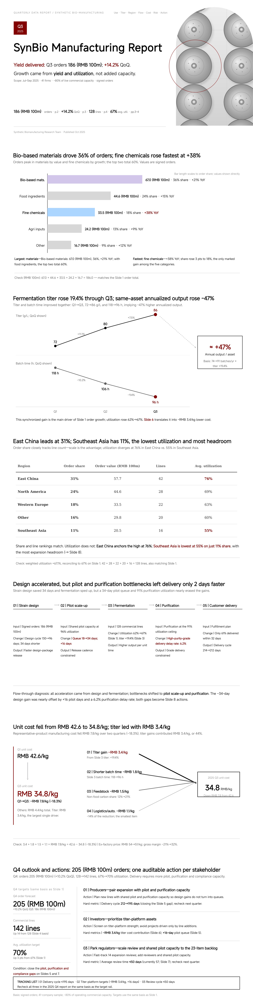

---

## 补充目录

与主目录互补的编号英文稿；同样可按主题 ID 点名。

### 策略 · Strategy

#### `dusk-violet-consulting` — Dusk Violet Consulting

- **风格**: 暮紫咨询思想领导力报告风
- **文件**: [`01/en/dusk-violet-consulting.md`](skills/open-kimi-ppt/reference/design_system/01_strategy/01/en/dusk-violet-consulting.md)
- **点名**: `用 dusk-violet-consulting`

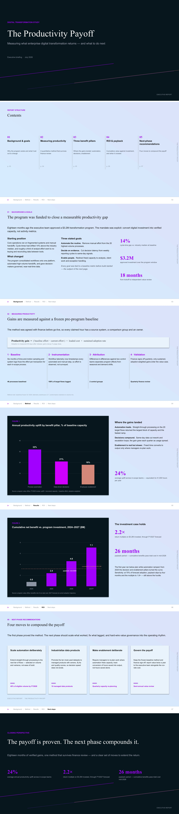

#### `red-black-business` — Red Black Business

- **风格**: 红黑管理咨询全案模板风
- **文件**: [`04/en/red-black-business.md`](skills/open-kimi-ppt/reference/design_system/01_strategy/04/en/red-black-business.md)
- **点名**: `用 red-black-business`

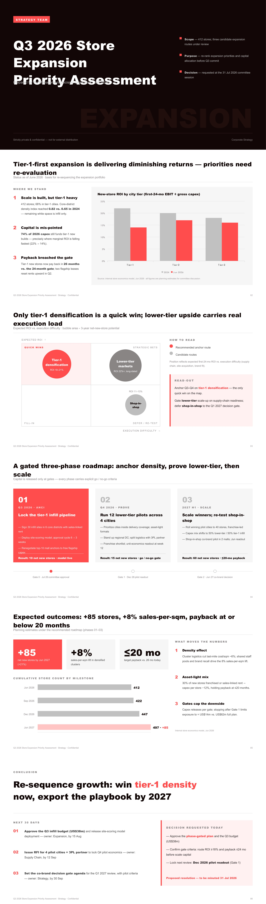

#### `map-strategy` — Cartographic Strategy

- **风格**: 地图战略风，国际化/区域布局
- **文件**: [`06/en/map-strategy.md`](skills/open-kimi-ppt/reference/design_system/01_strategy/06/en/map-strategy.md)
- **点名**: `用 map-strategy`

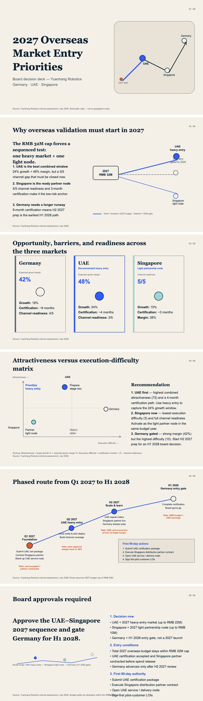

### 商务 · Business

#### `xuan-paper-annual` — Xuan Paper Annual

- **风格**: 宣纸年刊风，超重标题编辑研究刊
- **文件**: [`03/en/xuan-paper-annual.md`](skills/open-kimi-ppt/reference/design_system/02_business/03/en/xuan-paper-annual.md)
- **点名**: `用 xuan-paper-annual`

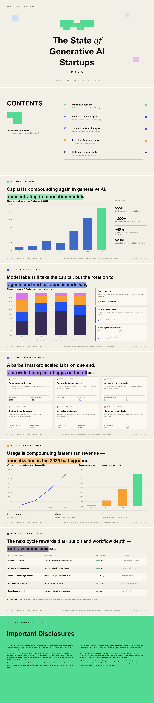

#### `lead-gray-quarterly` — Lead Gray Quarterly

- **风格**: 铅灰季报风，财经报纸式数据监测
- **文件**: [`04/en/lead-gray-quarterly.md`](skills/open-kimi-ppt/reference/design_system/02_business/04/en/lead-gray-quarterly.md)
- **点名**: `用 lead-gray-quarterly`

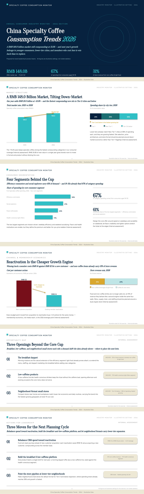

#### `ink-green-market-trends` — Ink Green Market Trends

- **风格**: 墨绿行情风，深色加密/市场季报
- **文件**: [`05/en/ink-green-market-trends.md`](skills/open-kimi-ppt/reference/design_system/02_business/05/en/ink-green-market-trends.md)
- **点名**: `用 ink-green-market-trends`

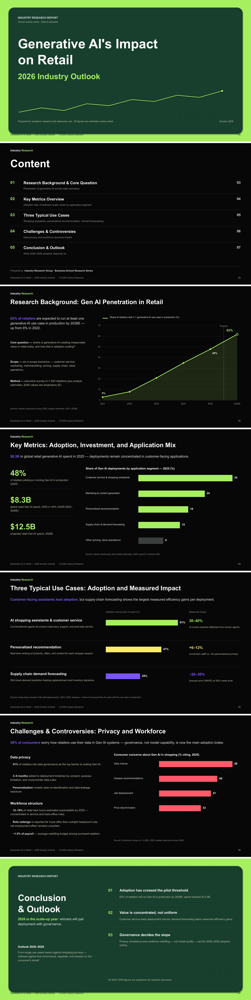

#### `orange-tech` — Orange Tech

- **风格**: 橙色科技年报与商业洞察风
- **文件**: [`06/en/orange-tech.md`](skills/open-kimi-ppt/reference/design_system/02_business/06/en/orange-tech.md)
- **点名**: `用 orange-tech`

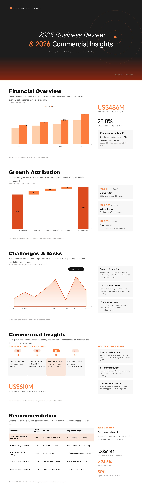

### 工作 · Work

#### `mist-blue-travelogue` — Mist Blue Travelogue

- **风格**: 雾蓝游记风，旅行酒店行业研究
- **文件**: [`02/en/mist-blue-travelogue.md`](skills/open-kimi-ppt/reference/design_system/03_work/02/en/mist-blue-travelogue.md)
- **点名**: `用 mist-blue-travelogue`

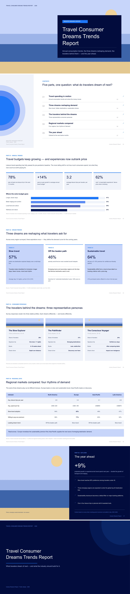

#### `color-stripes-documentary` — Color Stripes Documentary

- **风格**: 彩条纪实风，影响力/ESG 长叙事
- **文件**: [`04/en/color-stripes-documentary.md`](skills/open-kimi-ppt/reference/design_system/03_work/04/en/color-stripes-documentary.md)
- **点名**: `用 color-stripes-documentary`

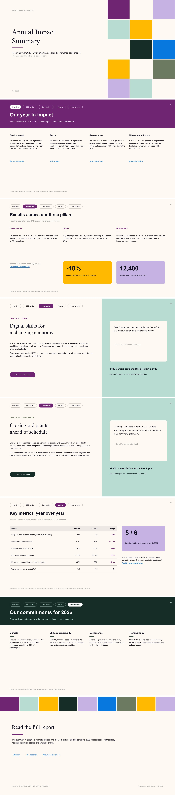

#### `red-white-business` — Red White Business

- **风格**: 红白商务风，雇主品牌与组织能力
- **文件**: [`06/en/red-white-business.md`](skills/open-kimi-ppt/reference/design_system/03_work/06/en/red-white-business.md)
- **点名**: `用 red-white-business`

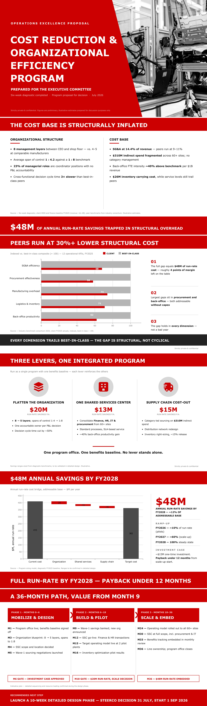

### 推广 · Promotion

#### `gold-orange-type-journal` — Gold Orange Type Journal

- **风格**: 金橙字体趋势刊风
- **文件**: [`04/en/gold-orange-type-journal.md`](skills/open-kimi-ppt/reference/design_system/04_promotion/04/en/gold-orange-type-journal.md)
- **点名**: `用 gold-orange-type-journal`

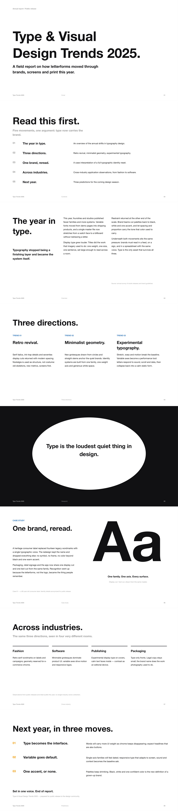

#### `fresh-brand` — Fresh Brand

- **风格**: 清新品牌权益/影响力报告风
- **文件**: [`06/en/fresh-brand.md`](skills/open-kimi-ppt/reference/design_system/04_promotion/06/en/fresh-brand.md)
- **点名**: `用 fresh-brand`

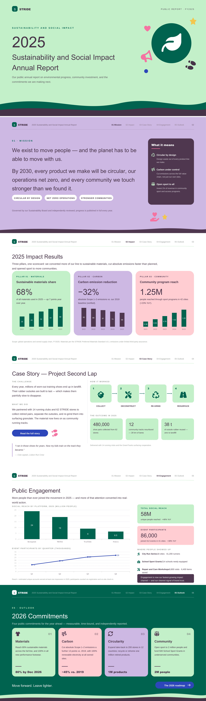

### 学术 · Academic

#### `pink-purple-diagnosis` — Soft Cloud-Layer Diagnostic Narrative

- **风格**: 粉紫云层诊断叙事风
- **文件**: [`01/en/pink-purple-diagnosis.md`](skills/open-kimi-ppt/reference/design_system/05_academic/01/en/pink-purple-diagnosis.md)
- **点名**: `用 pink-purple-diagnosis`

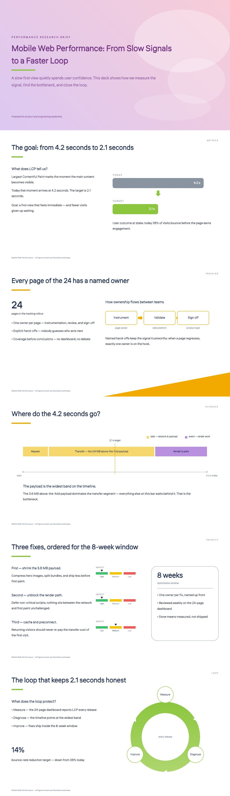

#### `dark-themed-data` — Dark Themed Data

- **风格**: 深色数据主题，加密/市场研究仪表盘
- **文件**: [`06/en/dark-themed-data.md`](skills/open-kimi-ppt/reference/design_system/05_academic/06/en/dark-themed-data.md)
- **点名**: `用 dark-themed-data`

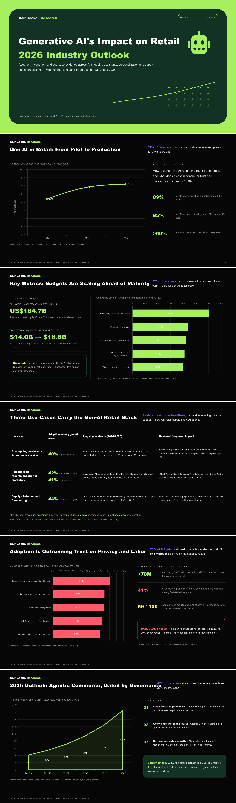

---

## 快速索引

| 分类 | 主题 ID |
|---|---|
| 咨询策略 | `apricot-white-brief` · `indigo-due-diligence` · `marine-blue-research` · `moss-green-transformation` · `pine-green-strategy` · `red-black-growth` |
| 商务财务 | `black-gold-ledger` · `ebony-ledger` · `honey-orange-memo` · `lake-blue-memo` · `prospect-annual` · `rice-paper-annual` |
| 工作汇报 | `blue-flame-brand` · `electric-violet-business` · `moon-white-imagery` · `sky-blue-wayfinding` · `warm-clay-works` · `warm-jade-annual-report` |
| 品牌推广 | `aqua-charity-report` · `cream-collage` · `pine-soot-pictorial` · `silk-yellow-magazine` · `silver-gray-luxury-magazine` · `travel-green-handbook` |
| 学术教育 | `blue-line-courseware` · `deep-blue-atlas` · `paper-white-courseware` · `pastel-derivation` · `teal-green-academic-defense` · `wine-red-data` |
| 补充 | `dusk-violet-consulting` · `red-black-business` · `map-strategy` · `xuan-paper-annual` · `lead-gray-quarterly` · `ink-green-market-trends` · `orange-tech` · `mist-blue-travelogue` · `color-stripes-documentary` · `red-white-business` · `gold-orange-type-journal` · `fresh-brand` · `pink-purple-diagnosis` · `dark-themed-data` |

## 统计

- 主目录：**30** 套
- 补充目录：**14** 套
- 合计：**44**
