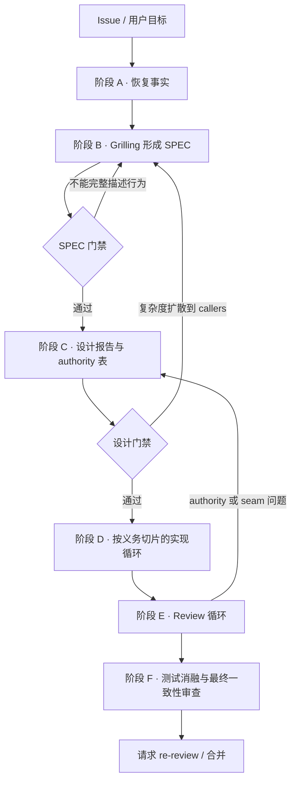

<div align="center">

<h1>PR Lifecycle</h1>

<p>
  <strong>把 PR 当作一份持续收敛的契约</strong><br/>
  <sub>An agent skill for the full PR lifecycle — SPEC · design · implementation · review · ablation</sub>
</p>

<p>
  <a href="./LICENSE"></a>
  
  
  
</p>

</div>

---

## 它解决什么问题

大 PR 出问题的地方通常不是代码写错了，而是契约从未被写清楚：

- SPEC、架构设计和实现机制混在同一张规则表里，没人分得清哪条是「用户要求的行为」，哪条只是「当前碰巧这么实现」；
- 同一条规则在两个 module 里各自判断，修一处漏三处；
- review 意见被当成代码指令逐条执行，越改越复杂，最后没人能说出系统当前的真实行为；
- 测试层层重复验证同一条 RULE，却没有一个能在规则被破坏时失败。

`pr-lifecycle` 是一个 Skill：它给 Agent 一套从 issue 到合并的执行纪律，让代码、测试和设计报告始终与当前契约一致。

## 核心主张

| 主张 | 含义 |
|---|---|
| 四类内容分离 | 开发过程规则归 `AGENTS.md`，SPEC 归 issue/规格，架构设计归设计报告，实现机制归代码 |
| 唯一 authority | 每条规则、状态、错误语义和资源上限，只由一个 module 最终决定；调用方不重新推断结果 |
| 机制可替换，契约不可含糊 | 算法和存储方案是实现机制，不应被写成产品需求；只要外部契约不变就该能换掉 |
| review 意见是证据，不是指令 | 先定位被违反的 SPEC 义务和真正的 authority，再选满足该义务的最小修复 |
| 测试要能表达意图 | 保留能在旧行为上失败、且靠近 authority 的测试；删除重复、伪 regression 和靠 wall-clock 猜测的测试 |
| 复杂度要问出处 | 说不清新增复杂度对应哪条 SPEC 义务时，返回设计门禁而不是继续叠加补丁 |

## 生命周期



每个阶段都维护三行状态：**已确认 / 正在处理 / 尚未解决**。流程本身不阻塞已获授权的安全工作，只有真正改变产品结果的未决决定才会回头找用户确认。

## 三个门禁

**SPEC 门禁** — 能用模板的 SPEC 部分完整描述行为，且每条验收标准都能追溯到某个场景、RULE 或不变量。不通过就不要先选实现机制。

**设计门禁** — 每条规则只有一个 authority；错误产生、标准化、展示由不同职责清楚承担；资源测量与上限有明确归属；删掉这个 module 后复杂度会消失（locality）而不是扩散到所有 callers。

**最终门禁** — SPEC、设计报告、代码、测试一致；没有废弃机制和过期文档；每个保留测试都对应最终义务或真实 seam；项目要求的 build / format / lint / typecheck / tests 已运行，未运行的项目被明确报告。

## 安装

把仓库克隆到你的 Agent 的 skills 目录：

```bash
git clone https://github.com/wutongyuonce/pr-lifecycle.git ~/.pi/agent/skills/pr-lifecycle
```

不同客户端的目录不同（Claude Code 用 `~/.claude/skills/`，Codex / Agent Skills 规范用 `~/.agents/skills/`），克隆位置不重要，入口始终是 `SKILL.md`。

## 触发

Skill 由 `SKILL.md` frontmatter 中的 description 触发，不需要手动调用。典型场景：

```text
继续这个 PR
处理最新 review
检查设计边界
按这个 issue 实现，跨 3 个 module
更新 PR 设计报告
```

一次性修一行、或只做只读的 PR 总结时不会触发；除非你明确要求设计或流程分析。

## 仓库结构

```text
SKILL.md                                      # 主入口：四类内容分离、六个阶段、三个门禁
references/spec-and-design-template.md        # SPEC 与设计报告模板（Part A / Part B）
references/review-and-ablation-checklist.md   # Review、机制审计、测试消融、最终一致性检查表
```

模板和检查表是可选工具，按任务规模裁剪即可 —— 不要为了填模板制造内容。

## 与其它 Skill 的关系

- `grilling`（可选）：阶段 B 需要追问未决策分支时使用；若环境中没有该 Skill，按同样的分轮追问方式自行展开。
- 项目自带的 `AGENTS.md` / `CONTRIBUTING` / 仓库规范优先级更高。与 Skill 冲突时，指出冲突并采用更具体的项目规则。
- 人类的 approval 和项目要求的 CI 不可被 AI review 替代。

## English

**PR Lifecycle** is an agent skill that treats a pull request as a contract that keeps converging: first decide what the system must guarantee, then decide which modules implement it through which interfaces — and keep code, tests, and the design report aligned with that contract.

It separates four kinds of content (process rules · SPEC · architecture · implementation mechanism), assigns every rule, state, error, and resource limit a single authority, and runs a six-stage loop from fact recovery and grilling to implementation, review, test ablation, and final re-review. Reference templates for the SPEC / design report and the review & ablation checklist are included.

Install: clone this repo into your agent's skills directory and point your agent at it — `SKILL.md` is the entry point.

## License

[MIT](./LICENSE)
