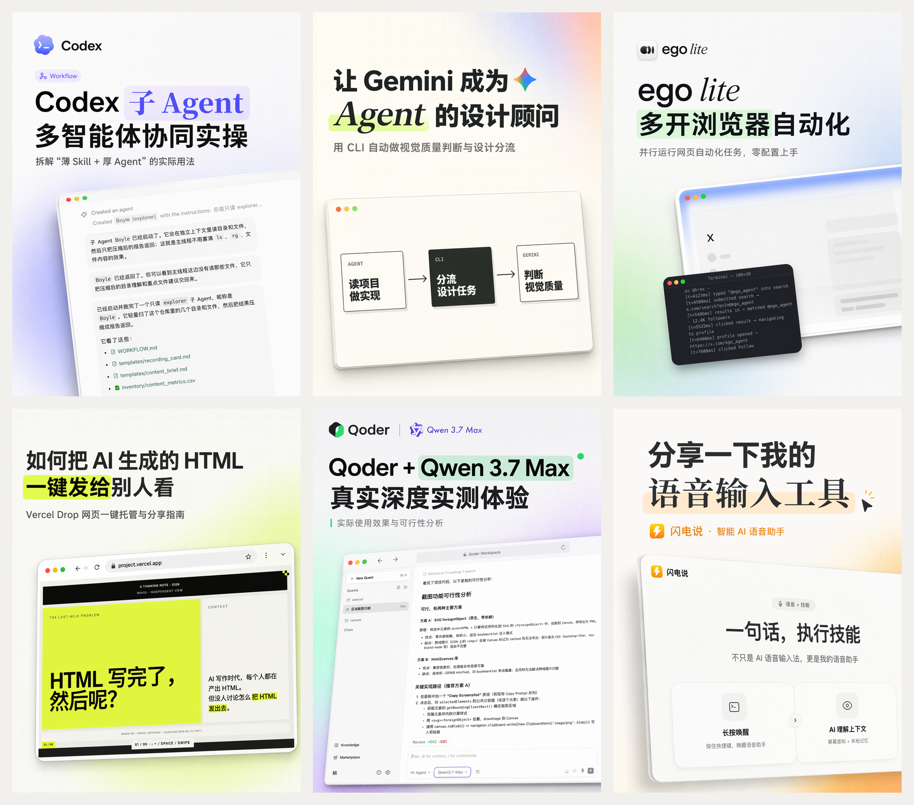
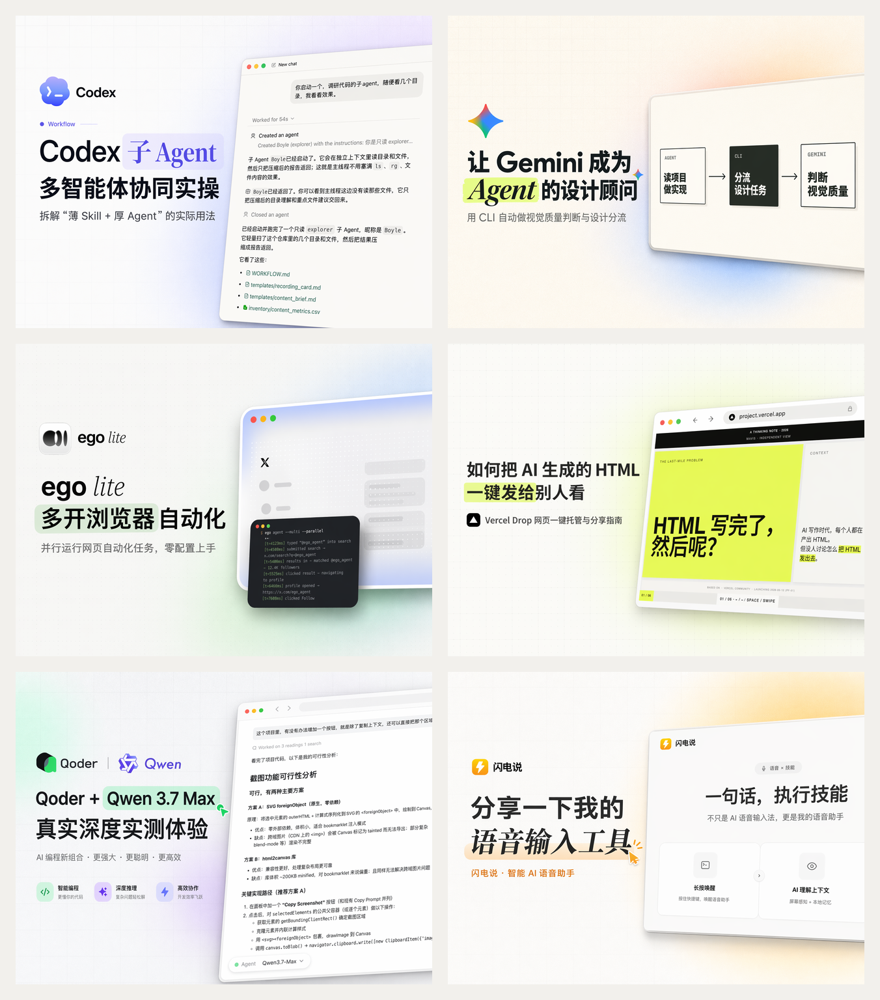

# oil-cover

基于真实视频内容生成三种画幅的封面，支持选帧分析、标题设计和可选创作者头像合成。

方向是 **真实屏幕证据 + Apple-like 产品视觉 + 清晰标题 + 无人物干净构图**，一次性整图生成，不靠本地贴字拼图。

> 作者：oil 欧呦（[@oil-oil](https://github.com/oil-oil)）

## 封面示例

<p align="center">
  
</p>
<p align="center">
  
</p>

## 特点

- **视频选帧**：本地扫描和评分筛出高清候选帧，再由多模态模型按语义选择，不上传整段视频。
- **完整视觉规范**：`references/cover-rules.md` 覆盖构图、背景层、字体标题、点缀、自动质检和提示词骨架。
- **默认三画幅**：并行出小红书 `3:4` 竖版、B 站首页主封面 `4:3` 横版和个人空间伴随版 `16:9` 横版。
- **产品 Logo 自动匹配**：内置 Claude / Codex / Cursor / Gemini / GitHub 等常用 AI 产品 Logo。

已指定的封面标题会锁定到分析与各画幅提示词中。有标题或主题时，Logo 匹配不再回退到字幕里的次要品牌；没有可信资产时使用产品名和真实界面建立识别。新增参考资产见 [资产列表](references/product-assets.md)。

## 两种执行模式

| | 脚本模式（默认） | Agent 自主执行 |
| --- | --- | --- |
| 怎么跑 | 跑 `scripts/generate_oil_cover.py` | 执行的 Agent 自己读 SOP 端到端完成 |
| 选帧 / 分析 | ZenMux 上的 Gemini | Agent 自身多模态视觉 |
| 生图 | ZenMux `gpt-image-2` | Agent 自带图像生成工具（图生图） |
| 依赖 | Python + ffmpeg + ZenMux key | 仅需带生图工具的 Agent（如 Codex 内置 `image_gen`） |
| 适合 | 高保真、可复现 | 零外部依赖、零 key |

模式偏好记在 `~/.oil-cover/config.json`，设一次以后不再问。自主模式完整流程见 [`references/agent-native-flow.md`](references/agent-native-flow.md)。

## 安装

使用支持的 Skill 安装器：

```bash
npx skills add oil-oil/oil-cover
```

运行时使用当前 Skill 目录中的脚本与资源，不要求安装到某个宿主的固定目录。`--api-key` 明文命令参数已停用；环境变量或已有私有凭据文件仍可读取。

## 用法（脚本模式）

```bash
python3 "<Skill绝对目录>/scripts/generate_oil_cover.py" \
  --video "<视频路径>" \
  --title "<标题或主题>" \
  --topic "<补充背景>"
```

截图 / 关键帧输入：

```bash
python3 "<Skill绝对目录>/scripts/generate_oil_cover.py" \
  --image "<截图路径>" \
  --logo "<可选 Logo 路径>" \
  --title "<标题>"
```

默认并行出 `3:4` + `4:3` + `16:9`。完整参数（取帧策略、`--dry-run`、`--skip-generate` 等）见 [`SKILL.md`](SKILL.md)。

### 配置 ZenMux key（仅脚本模式需要）

脚本调用 ZenMux（Gemini 分析 + `gpt-image-2` 生图），需要 API key。按优先级读取：

1. `ZENMUX_API_KEY` 环境变量
2. `--api-key-file` 指定的文件；未指定时使用用户配置中的 `api_key_file`，最后回退到 `~/.config/oil-cover/zenmux_api_key`

日常使用优先配置环境变量或外部密钥文件，不把密钥写进 Skill、提示词或 Git 仓库。

### 依赖

- Python 3.9+
- `ffmpeg`（视频抽帧）
- 一个 ZenMux 账号与 API key

## 用法（Agent 自主执行）

在带图像生成工具的 Agent（如 Codex）里触发，Agent 会读 [`references/agent-native-flow.md`](references/agent-native-flow.md) 自己完成选帧、分析、出图，**不需要 ZenMux key**。生图那一步在 Codex 里用其系统级 `imagegen` 的内置 `image_gen` 工具（图生图）。

## 本地测试

```bash
python3 -m unittest discover -s tests -p 'test_*.py'
```

测试通过主入口验证 Logo 选择、标题锁定和 sidecar 写入，使用模拟分析结果，不调用外部 API 或生成图片。

## 目录结构

```
SKILL.md                        技能主说明（两种模式 + 参数）
scripts/generate_oil_cover.py   脚本模式实现
references/
  cover-rules.md                完整视觉规范
  agent-native-flow.md          Agent 自主执行 SOP
  impact-tech-cover-style.md    可选的冲击型科技封面风格
  product-assets.md             产品 Logo 资产清单
assets/product-logos/           内置 AI 产品 Logo
```

## 商标与第三方资产

`assets/product-logos/` 内的产品 Logo 为各自公司商标，仅作封面参考资产，**不在本项目 MIT 许可范围内**，收录于此不代表任何合作或背书。来源与归属见 [NOTICE](NOTICE)。

## License

[MIT](LICENSE) © 2026 oil 欧呦

## API Key 配置页面

首次使用外部服务时，可以在本机配置页亲自填写 Key；已有配置会复用，密钥存入系统凭据库。只为实际使用的外部服务配置；纯本地处理不需要 Key。页面需要 Node.js 22.18+ 与可用的系统凭据服务，业务运行仍使用原依赖。

安装、状态检查、打开页面和带凭据运行的完整入口见[配置说明](references/api-key-setup.md)。页面保存与业务读取已经接通；不把 Key 发进聊天，也不自动迁移旧文件。
