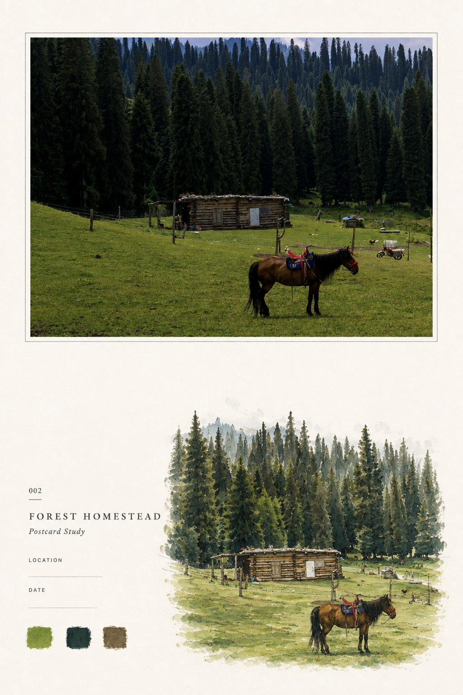
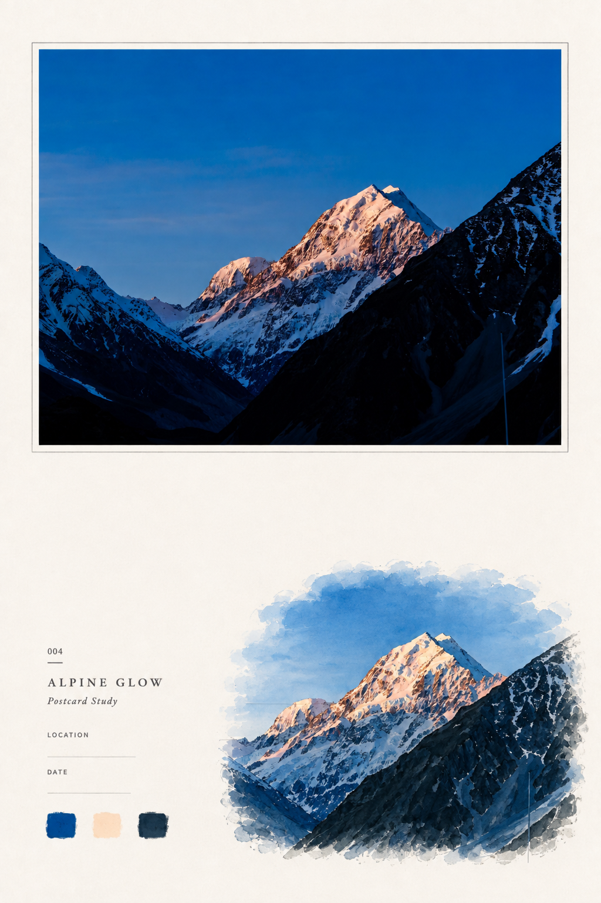
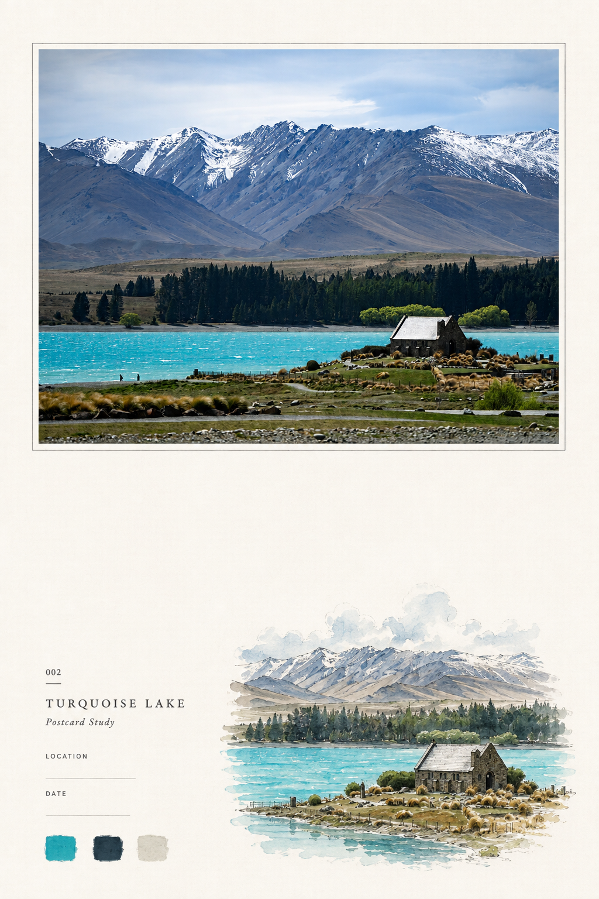
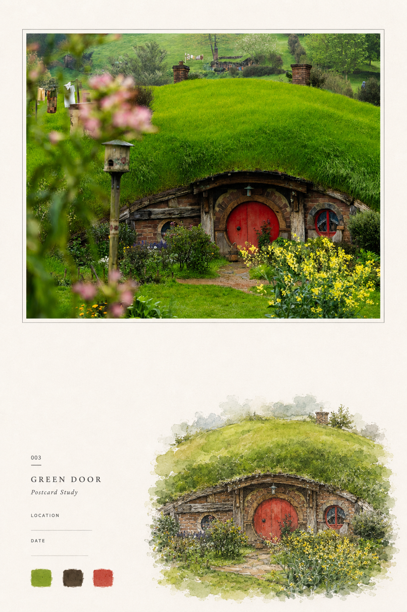
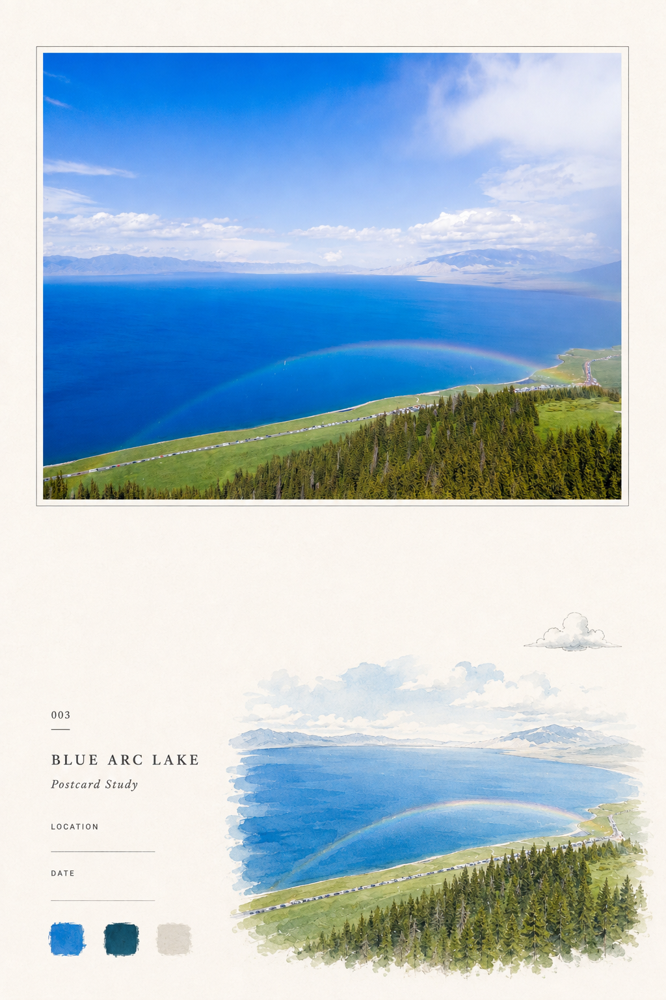
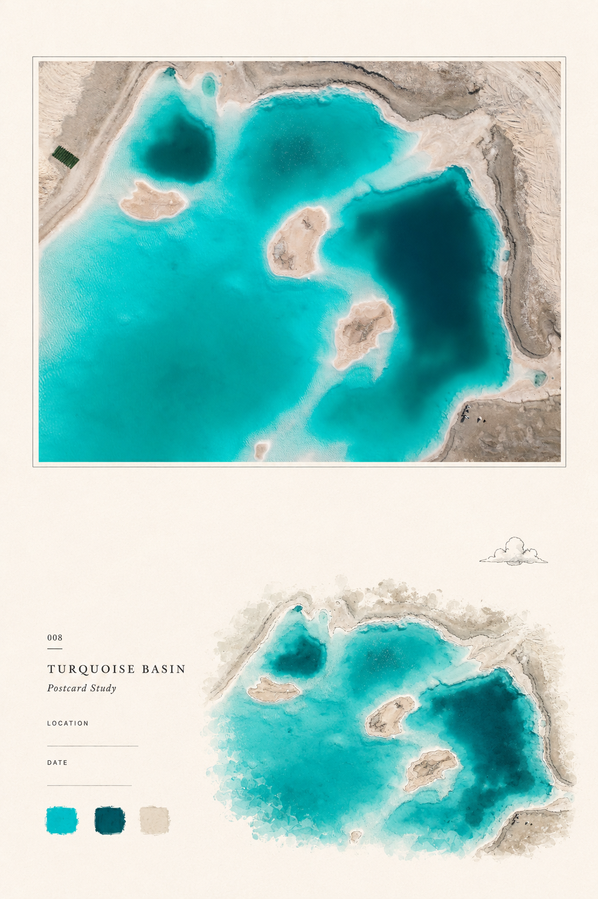
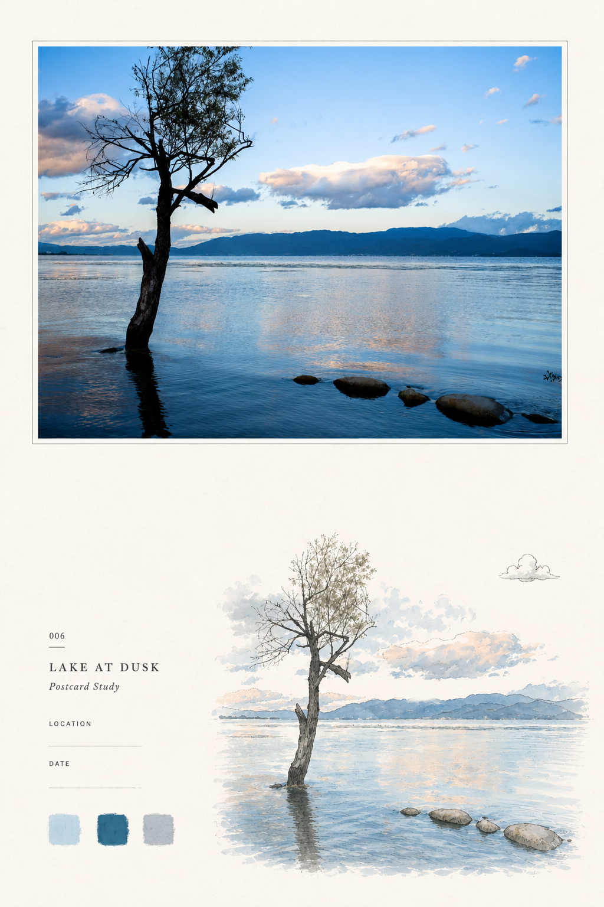
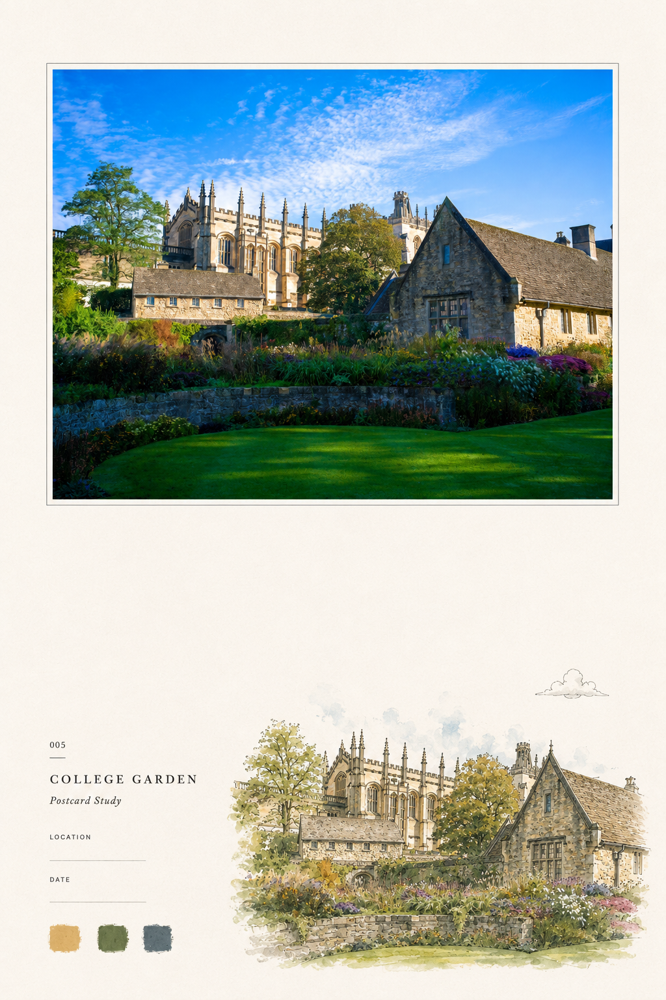
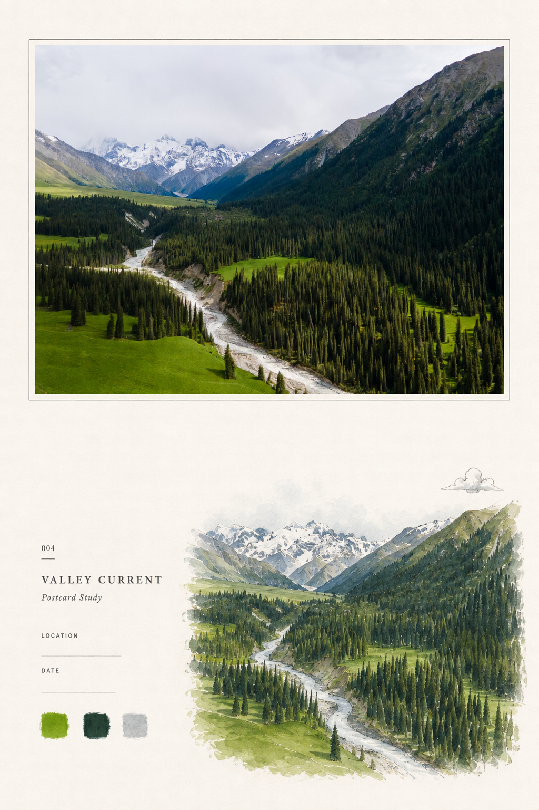

# Photo to Zine Postcard

[中文](README.md) · **English**

Turn your own photographs into minimal editorial zine-style postcards with ChatGPT.

This repository provides a reusable `SKILL.md` specification that turns one source photo into a coordinated postcard set:

- **Front** — the original photo stays intact at the top with its aspect ratio preserved; the lower area uses generous whitespace, one source-derived hand-drawn editorial motif, minimal metadata, and three sampled color swatches.
- **Back** — a matching functional postcard back with stamp area, divider, address lines, and writing space.

<table>
  <tr>
    <td><a href="assets/forest-homestead.png"></a></td>
    <td><a href="assets/alpine-glow.png"></a></td>
    <td><a href="assets/turquoise-lake.png"></a></td>
  </tr>
  <tr>
    <td><a href="assets/green-door.png"></a></td>
    <td><a href="assets/blue-arc-lake.png"></a></td>
    <td><a href="assets/turquoise-basin.png"></a></td>
  </tr>
  <tr>
    <td><a href="assets/lake-at-dusk.png"></a></td>
    <td><a href="assets/college-garden.png"></a></td>
    <td><a href="assets/valley-current.png"></a></td>
  </tr>
</table>

These nine official examples cover forest, mountain, lake, aerial landscape, architecture, garden, and dusk scenes. Click an image to view it at full size.

## Quick Start

1. Give ChatGPT this repository, or upload [`SKILL.md`](SKILL.md).
2. Upload a photo you took.
3. Ask ChatGPT:

```text
Please read SKILL.md from this repository and follow it as the only design specification.
Generate a Photo to Zine Postcard front and back from my uploaded photo.
```

If ChatGPT cannot access the repository directly, download `SKILL.md` and upload it together with your image.

## Design Philosophy

Photo to Zine Postcard follows five principles:

1. Keep the original photograph as the visual anchor.
2. Preserve its original aspect ratio.
3. Use generous whitespace instead of filling the page.
4. Choose one visually strong, source-defining motif.
5. Reinterpret that motif carefully with a restrained hand-drawn editorial feeling.

The goal is not a generic AI poster. It is a printable personal postcard system.

## Default Output

- portrait `2:3`
- reference size `100 × 150 mm / 4 × 6 in`
- warm ivory paper
- embedded original photograph
- one main hand-drawn source motif
- optional one supporting motif
- exactly three source-derived color swatches
- matching functional postcard back

## Customize Your Own Version

This repository is designed for forking and modification. You can customize:

- illustration style
- paper texture
- typography
- postcard ratio
- metadata layout
- front/back composition
- motif extraction strategy

See [`docs/CUSTOMIZATION.md`](docs/CUSTOMIZATION.md) for a practical guide. For major style experiments, creating a variant is preferable to making the default skill more complicated.

## Official Examples

The current example set includes:

- [Forest Homestead](assets/forest-homestead.png)
- [Alpine Glow](assets/alpine-glow.png)
- [Turquoise Lake](assets/turquoise-lake.png)
- [Green Door](assets/green-door.png)
- [Blue Arc Lake](assets/blue-arc-lake.png)
- [Turquoise Basin](assets/turquoise-basin.png)
- [Lake at Dusk](assets/lake-at-dusk.png)
- [College Garden](assets/college-garden.png)
- [Valley Current](assets/valley-current.png)

See [`examples/README.md`](examples/README.md) for the example index.

## Repository Structure

```text
photo-to-zine-postcard/
├── SKILL.md
├── README.md
├── README_EN.md
├── CHANGELOG.md
├── CONTRIBUTING.md
├── LICENSE
├── docs/
│   └── CUSTOMIZATION.md
├── examples/
│   └── README.md
└── assets/
    ├── forest-homestead.png
    ├── ...            # remaining semantically named official examples
    └── README.md
```

## Current Version

**v1.0.0** — first public release of the Photo to Zine Postcard skill.

The current version is optimized for ChatGPT image generation and for clean, detailed output suitable for later 4× super-resolution enlargement.

## Contributing

Pull requests and derivative styles are welcome. See [`CONTRIBUTING.md`](CONTRIBUTING.md).

## License

MIT License. See [`LICENSE`](LICENSE).
